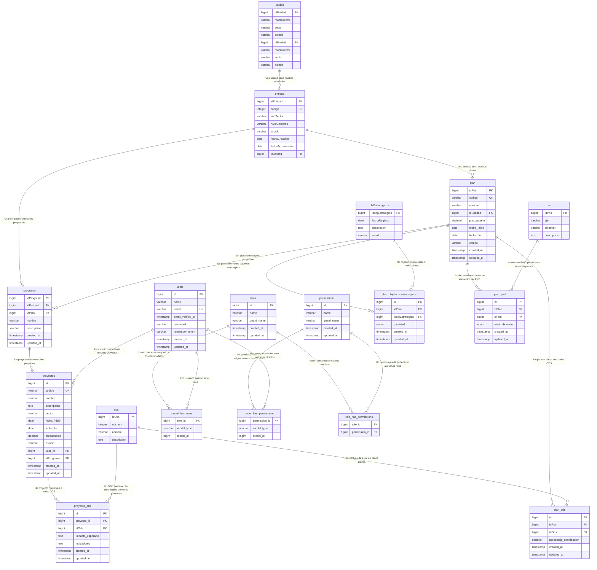

# 📊 **DIAGRAMA DE BASE DE DATOS - Sistema de Gestión de Planificación Institucional**

## 🏗️ **ARQUITECTURA DE LA BASE DE DATOS**

Este diagrama muestra la estructura completa de la base de datos del Sistema de Gestión de Planificación Institucional con todas sus tablas, campos y relaciones.

---

## 🗂️ **TABLAS PRINCIPALES**

### 👥 **TABLA: users**
```sql
┌─────────────────────────────────────────┐
│                 users                   │
├─────────────────────────────────────────┤
│ 🔑 id (PK)              BIGINT         │
│    name                  VARCHAR(255)   │
│    email                 VARCHAR(255)   │ [UNIQUE]
│    email_verified_at     TIMESTAMP      │ [NULL]
│    password              VARCHAR(255)   │
│    remember_token        VARCHAR(100)   │ [NULL]
│    created_at            TIMESTAMP      │
│    updated_at            TIMESTAMP      │
└─────────────────────────────────────────┘
```

### 🏛️ **TABLA: entidad**
```sql
┌─────────────────────────────────────────┐
│                entidad                  │
├─────────────────────────────────────────┤
│ 🔑 idEntidad (PK)        BIGINT         │
│    codigo                INTEGER        │ [UNIQUE]
│    subSector             VARCHAR(255)   │
│    nivelGobierno         VARCHAR(255)   │
│    estado                VARCHAR(255)   │
│    fechaCreacion         DATE           │
│    fechaActualizacion    DATE           │ [NULL]
└─────────────────────────────────────────┘
```

### 📋 **TABLA: programa**
```sql
┌─────────────────────────────────────────┐
│               programa                  │
├─────────────────────────────────────────┤
│ 🔑 idPrograma (PK)       BIGINT         │
│ 🔗 idEntidad (FK)        BIGINT         │ → entidad.idEntidad
│    nombre                VARCHAR(255)   │
│    descripcion           VARCHAR(255)   │ [NULL]
│    created_at            TIMESTAMP      │
│    updated_at            TIMESTAMP      │
└─────────────────────────────────────────┘
```

### 📊 **TABLA: proyectos**
```sql
┌─────────────────────────────────────────┐
│              proyectos                  │
├─────────────────────────────────────────┤
│ 🔑 id (PK)               BIGINT         │
│    codigo                VARCHAR(255)   │ [UNIQUE]
│    nombre                VARCHAR(255)   │
│    descripcion           TEXT           │
│    sector                VARCHAR(255)   │
│    fecha_inicio          DATE           │
│    fecha_fin             DATE           │
│    presupuesto          DECIMAL(12,2)   │
│    estado               VARCHAR(255)    │ [DEFAULT: 'borrador']
│ 🔗 user_id (FK)         BIGINT          │ → users.id
│    created_at           TIMESTAMP       │
│    updated_at           TIMESTAMP       │
└─────────────────────────────────────────┘
```

### 📋 **TABLA: plan**
```sql
┌─────────────────────────────────────────┐
│                 plan                    │
├─────────────────────────────────────────┤
│ 🔑 idPlan (PK)          BIGINT          │
│    codigo               VARCHAR(255)    │ [UNIQUE]
│    nombre               VARCHAR(255)    │
│    entidad              TEXT            │
│    presupuesto         DECIMAL(12,2)    │
│    fecha_inicio        DATE             │
│    fecha_fin           DATE             │
│    estado              VARCHAR(255)     │ [DEFAULT: 'estado']
│    created_at          TIMESTAMP        │
│    updated_at          TIMESTAMP        │
└─────────────────────────────────────────┘
```

### 🌍 **TABLA: ods** (Objetivos de Desarrollo Sostenible)
```sql
┌─────────────────────────────────────────┐
│                  ods                    │
├─────────────────────────────────────────┤
│ 🔑 idOds (PK)           BIGINT          │
│    odsnum               INTEGER         │
│    nombre               VARCHAR(255)    │
│    descripcion          TEXT            │
└─────────────────────────────────────────┘
```

### 🎯 **TABLA: objEstrategicos** (Objetivos Estratégicos)
```sql
┌─────────────────────────────────────────┐
│            objEstrategicos              │
├─────────────────────────────────────────┤
│ 🔑 idobjEstrategico (PK) BIGINT         │
│    fechaRegistro         DATE           │
│    descripcion           TEXT           │
│    estado                VARCHAR(255)   │
└─────────────────────────────────────────┘
```

### 🇵🇪 **TABLA: pnd** (Plan Nacional de Desarrollo)
```sql
┌─────────────────────────────────────────┐
│                 pnd                     │
├─────────────────────────────────────────┤
│ 🔑 idPnd (PK)           BIGINT          │
│    eje                  VARCHAR(255)    │
│    objetivoN            VARCHAR(255)    │
│    descripcion          TEXT            │
└─────────────────────────────────────────┘
```

### 📊 **TABLA: unidad**
```sql
┌─────────────────────────────────────────┐
│               unidad                    │
├─────────────────────────────────────────┤
│ 🔑 idUnidad (PK)        BIGINT          │
│    macrosector          VARCHAR(255)    │
│    sector               VARCHAR(255)    │
│    estado               VARCHAR(255)    │
└─────────────────────────────────────────┘
```

---

## 🛡️ **TABLAS DEL SISTEMA DE PERMISOS Y ROLES (Spatie)**

### 👤 **TABLA: roles**
```sql
┌─────────────────────────────────────────┐
│                roles                    │
├─────────────────────────────────────────┤
│ 🔑 id (PK)              BIGINT          │
│    name                 VARCHAR(255)    │
│    guard_name           VARCHAR(255)    │
│    created_at           TIMESTAMP       │
│    updated_at           TIMESTAMP       │
└─────────────────────────────────────────┘
```

### 🔐 **TABLA: permissions**
```sql
┌─────────────────────────────────────────┐
│              permissions                │
├─────────────────────────────────────────┤
│ 🔑 id (PK)              BIGINT          │
│    name                 VARCHAR(255)    │
│    guard_name           VARCHAR(255)    │
│    created_at           TIMESTAMP       │
│    updated_at           TIMESTAMP       │
└─────────────────────────────────────────┘
```

### 🔗 **TABLA: model_has_roles** (Tabla Pivot)
```sql
┌─────────────────────────────────────────┐
│             model_has_roles             │
├─────────────────────────────────────────┤
│ 🔗 role_id (FK)         BIGINT          │ → roles.id
│    model_type           VARCHAR(255)    │
│    model_id             BIGINT          │
└─────────────────────────────────────────┘
```

### 🔗 **TABLA: model_has_permissions** (Tabla Pivot)
```sql
┌─────────────────────────────────────────┐
│          model_has_permissions          │
├─────────────────────────────────────────┤
│ 🔗 permission_id (FK)   BIGINT          │ → permissions.id
│    model_type           VARCHAR(255)    │
│    model_id             BIGINT          │
└─────────────────────────────────────────┘
```

### 🔗 **TABLA: role_has_permissions** (Tabla Pivot)
```sql
┌─────────────────────────────────────────┐
│           role_has_permissions          │
├─────────────────────────────────────────┤
│ 🔗 role_id (FK)         BIGINT          │ → roles.id
│ 🔗 permission_id (FK)   BIGINT          │ → permissions.id
└─────────────────────────────────────────┘
```

---

## 🔄 **TABLAS AUXILIARES DEL SISTEMA**

### 🔑 **TABLA: password_reset_tokens**
```sql
┌─────────────────────────────────────────┐
│          password_reset_tokens          │
├─────────────────────────────────────────┤
│    email                VARCHAR(255)    │ [PK]
│    token                VARCHAR(255)    │
│    created_at           TIMESTAMP       │ [NULL]
└─────────────────────────────────────────┘
```

### 🔑 **TABLA: personal_access_tokens**
```sql
┌─────────────────────────────────────────┐
│          personal_access_tokens         │
├─────────────────────────────────────────┤
│ 🔑 id (PK)              BIGINT          │
│    tokenable_type       VARCHAR(255)    │
│    tokenable_id         BIGINT          │
│    name                 VARCHAR(255)    │
│    token                VARCHAR(64)     │ [UNIQUE]
│    abilities            TEXT            │ [NULL]
│    last_used_at         TIMESTAMP       │ [NULL]
│    expires_at           TIMESTAMP       │ [NULL]
│    created_at           TIMESTAMP       │
│    updated_at           TIMESTAMP       │
└─────────────────────────────────────────┘
```

### ❌ **TABLA: failed_jobs**
```sql
┌─────────────────────────────────────────┐
│              failed_jobs                │
├─────────────────────────────────────────┤
│ 🔑 id (PK)              BIGINT          │
│    uuid                 VARCHAR(255)    │ [UNIQUE]
│    connection           TEXT            │
│    queue                TEXT            │
│    payload              LONGTEXT        │
│    exception            LONGTEXT        │
│    failed_at            TIMESTAMP       │ [DEFAULT: now()]
└─────────────────────────────────────────┘
```

---

## 🔗 **DIAGRAMA DE RELACIONES MEJORADO**



---

## 📋 **RESUMEN DE RELACIONES IDENTIFICADAS**

### 🔗 **RELACIONES MEJORADAS EN MODELOS**

#### 📊 **JERARQUÍA ORGANIZACIONAL**
| **Modelo** | **Relación** | **Tipo** | **Descripción** |
|------------|--------------|----------|-----------------|
| **Unidad** | `entidades()` | HasMany | Una unidad tiene muchas entidades |
| **Entidad** | `unidad()` | BelongsTo | Una entidad pertenece a una unidad |
| **Entidad** | `planes()` | HasMany | Una entidad tiene muchos planes |
| **Entidad** | `programas()` | HasMany | Una entidad tiene muchos programas |
| **Plan** | `entidad()` | BelongsTo | Un plan pertenece a una entidad |
| **Plan** | `programas()` | HasMany | Un plan tiene muchos programas |
| **Programa** | `entidad()` | BelongsTo | Un programa pertenece a una entidad |
| **Programa** | `plan()` | BelongsTo | Un programa pertenece a un plan |
| **Programa** | `proyectos()` | HasMany | Un programa tiene muchos proyectos |
| **Proyecto** | `user()` | BelongsTo | Un proyecto pertenece a un usuario |
| **Proyecto** | `programa()` | BelongsTo | Un proyecto pertenece a un programa |
| **User** | `proyectos()` | HasMany | Un usuario tiene muchos proyectos |

#### 🎯 **ALINEACIÓN ESTRATÉGICA**
| **Modelo** | **Relación** | **Tipo** | **Descripción** |
|------------|--------------|----------|-----------------|
| **Plan** | `ods()` | BelongsToMany | Un plan se alinea con varios ODS |
| **Plan** | `objetivosEstrategicos()` | BelongsToMany | Un plan tiene varios objetivos estratégicos |
| **Plan** | `pnd()` | BelongsToMany | Un plan se alinea con varios elementos del PND |
| **Proyecto** | `ods()` | BelongsToMany | Un proyecto contribuye a varios ODS |

### 🔗 **RELACIONES DEL SISTEMA DE PERMISOS (SPATIE)**

| **Relación** | **Tipo** | **Descripción** |
|--------------|----------|-----------------|
| **User ↔ Role** | Many-to-Many | Los usuarios pueden tener múltiples roles |
| **User ↔ Permission** | Many-to-Many | Los usuarios pueden tener permisos directos |
| **Role ↔ Permission** | Many-to-Many | Los roles pueden tener múltiples permisos |

### � **TABLAS PIVOT PARA ALINEACIÓN ESTRATÉGICA**

| **Tabla Pivot** | **Relaciona** | **Campos Adicionales** | **Propósito** |
|-----------------|---------------|------------------------|---------------|
| **plan_ods** | Plan ↔ ODS | `porcentaje_contribucion` | Medir contribución a objetivos globales |
| **plan_objetivos_estrategicos** | Plan ↔ Obj.Estratégicos | `prioridad` | Definir prioridades institucionales |
| **plan_pnd** | Plan ↔ PND | `nivel_alineacion` | Asegurar cumplimiento normativo nacional |
| **proyecto_ods** | Proyecto ↔ ODS | `impacto_esperado`, `indicadores` | Seguimiento detallado de impacto |

### 📊 **TABLAS DE CATÁLOGO (MAESTRAS)**

- **ODS**: Catálogo oficial de 17 Objetivos de Desarrollo Sostenible
- **PND**: Estructura del Plan Nacional de Desarrollo por ejes
- **objEstrategicos**: Objetivos estratégicos institucionales definidos

---

## ✅ **NUEVA ARQUITECTURA IMPLEMENTADA**

### 🏗️ **JERARQUÍA ORGANIZACIONAL COMPLETA**

```
UNIDAD (Macrosector/Sector)
    ↓ 1:N
ENTIDAD (Organismo específico)
    ↓ 1:N
PLAN (Planificación institucional) ←→ N:M ←→ ODS, PND, Obj.Estratégicos
    ↓ 1:N
PROGRAMA (Líneas de acción)
    ↓ 1:N
PROYECTO (Iniciativas específicas) ←→ N:M ←→ ODS
```

### 🎯 **BENEFICIOS DE LA NUEVA ESTRUCTURA**

1. **✅ Integridad Referencial**: Todas las entidades están relacionadas correctamente
2. **✅ Trazabilidad Completa**: Seguimiento desde planificación hasta ejecución
3. **✅ Alineación Estratégica**: Vínculos con marcos nacionales e internacionales
4. **✅ Flexibilidad**: Relaciones N:M para casos complejos de alineación
5. **✅ Escalabilidad**: Estructura preparada para crecimiento futuro

### � **IMPLEMENTACIÓN RECOMENDADA**

Para implementar estas mejoras, consulta el archivo: **`PROPUESTA_MEJORAS_BASE_DATOS.md`**

El archivo contiene:
- 📋 **Migraciones detalladas** para cada cambio
- 🔧 **Modelos Eloquent actualizados** con todas las relaciones
- 📊 **Scripts SQL** para las tablas pivot
- 🎯 **Plan de implementación** paso a paso

---

**📊 ESTADO ACTUAL: BASE DE DATOS CON ESTRUCTURA SÓLIDA Y SISTEMA DE PERMISOS IMPLEMENTADO**

*El diagrama muestra una base de datos bien estructurada con separación clara de responsabilidades, sistema completo de permisos y roles, y potencial para implementar relaciones adicionales que fortalezcan la integridad referencial del sistema.*