# 📊 **DIAGRAMA DE BASE DE DATOS - Sistema de Gestión de Planificación Institucional**

## 🏗️ **ARQUITECTURA DE LA BASE DE DATOS**

Este diagrama muestra la estructura completa de la base de datos del Sistema de Gestión de Planificación Institucional con todas sus tablas, campos y relaciones.

---

## 🗂️ **TABLAS PRINCIPALES**

### 👥 **TABLA: users**
```sql
┌─────────────────────────────────────────┐
│                 users                   │
├─────────────────────────────────────────┤
│ 🔑 id (PK)              BIGINT         │
│    name                  VARCHAR(255)   │
│    email                 VARCHAR(255)   │ [UNIQUE]
│    email_verified_at     TIMESTAMP      │ [NULL]
│    password              VARCHAR(255)   │
│    remember_token        VARCHAR(100)   │ [NULL]
│    created_at            TIMESTAMP      │
│    updated_at            TIMESTAMP      │
└─────────────────────────────────────────┘
```

### 🏛️ **TABLA: entidad**
```sql
┌─────────────────────────────────────────┐
│                entidad                  │
├─────────────────────────────────────────┤
│ 🔑 idEntidad (PK)        BIGINT         │
│    codigo                INTEGER        │ [UNIQUE]
│    subSector             VARCHAR(255)   │
│    nivelGobierno         VARCHAR(255)   │
│    estado                VARCHAR(255)   │
│    fechaCreacion         DATE           │
│    fechaActualizacion    DATE           │ [NULL]
└─────────────────────────────────────────┘
```

### 📋 **TABLA: programa**
```sql
┌─────────────────────────────────────────┐
│               programa                  │
├─────────────────────────────────────────┤
│ 🔑 idPrograma (PK)       BIGINT         │
│ 🔗 idEntidad (FK)        BIGINT         │ → entidad.idEntidad
│    nombre                VARCHAR(255)   │
│    descripcion           VARCHAR(255)   │ [NULL]
│    created_at            TIMESTAMP      │
│    updated_at            TIMESTAMP      │
└─────────────────────────────────────────┘
```

### 📊 **TABLA: proyectos**
```sql
┌─────────────────────────────────────────┐
│              proyectos                  │
├─────────────────────────────────────────┤
│ 🔑 id (PK)               BIGINT         │
│    codigo                VARCHAR(255)   │ [UNIQUE]
│    nombre                VARCHAR(255)   │
│    descripcion           TEXT           │
│    sector                VARCHAR(255)   │
│    fecha_inicio          DATE           │
│    fecha_fin             DATE           │
│    presupuesto          DECIMAL(12,2)   │
│    estado               VARCHAR(255)    │ [DEFAULT: 'borrador']
│ 🔗 user_id (FK)         BIGINT          │ → users.id
│    created_at           TIMESTAMP       │
│    updated_at           TIMESTAMP       │
└─────────────────────────────────────────┘
```

### 📋 **TABLA: plan**
```sql
┌─────────────────────────────────────────┐
│                 plan                    │
├─────────────────────────────────────────┤
│ 🔑 idPlan (PK)          BIGINT          │
│    codigo               VARCHAR(255)    │ [UNIQUE]
│    nombre               VARCHAR(255)    │
│    entidad              TEXT            │
│    presupuesto         DECIMAL(12,2)    │
│    fecha_inicio        DATE             │
│    fecha_fin           DATE             │
│    estado              VARCHAR(255)     │ [DEFAULT: 'estado']
│    created_at          TIMESTAMP        │
│    updated_at          TIMESTAMP        │
└─────────────────────────────────────────┘
```

### 🌍 **TABLA: ods** (Objetivos de Desarrollo Sostenible)
```sql
┌─────────────────────────────────────────┐
│                  ods                    │
├─────────────────────────────────────────┤
│ 🔑 idOds (PK)           BIGINT          │
│    odsnum               INTEGER         │
│    nombre               VARCHAR(255)    │
│    descripcion          TEXT            │
└─────────────────────────────────────────┘
```

### 🎯 **TABLA: objEstrategicos** (Objetivos Estratégicos)
```sql
┌─────────────────────────────────────────┐
│            objEstrategicos              │
├─────────────────────────────────────────┤
│ 🔑 idobjEstrategico (PK) BIGINT         │
│    fechaRegistro         DATE           │
│    descripcion           TEXT           │
│    estado                VARCHAR(255)   │
└─────────────────────────────────────────┘
```

### 🇵🇪 **TABLA: pnd** (Plan Nacional de Desarrollo)
```sql
┌─────────────────────────────────────────┐
│                 pnd                     │
├─────────────────────────────────────────┤
│ 🔑 idPnd (PK)           BIGINT          │
│    eje                  VARCHAR(255)    │
│    objetivoN            VARCHAR(255)    │
│    descripcion          TEXT            │
└─────────────────────────────────────────┘
```

### 📊 **TABLA: unidad**
```sql
┌─────────────────────────────────────────┐
│               unidad                    │
├─────────────────────────────────────────┤
│ 🔑 idUnidad (PK)        BIGINT          │
│    macrosector          VARCHAR(255)    │
│    sector               VARCHAR(255)    │
│    estado               VARCHAR(255)    │
└─────────────────────────────────────────┘
```

---

## 🛡️ **TABLAS DEL SISTEMA DE PERMISOS Y ROLES (Spatie)**

### 👤 **TABLA: roles**
```sql
┌─────────────────────────────────────────┐
│                roles                    │
├─────────────────────────────────────────┤
│ 🔑 id (PK)              BIGINT          │
│    name                 VARCHAR(255)    │
│    guard_name           VARCHAR(255)    │
│    created_at           TIMESTAMP       │
│    updated_at           TIMESTAMP       │
└─────────────────────────────────────────┘
```

### 🔐 **TABLA: permissions**
```sql
┌─────────────────────────────────────────┐
│              permissions                │
├─────────────────────────────────────────┤
│ 🔑 id (PK)              BIGINT          │
│    name                 VARCHAR(255)    │
│    guard_name           VARCHAR(255)    │
│    created_at           TIMESTAMP       │
│    updated_at           TIMESTAMP       │
└─────────────────────────────────────────┘
```

### 🔗 **TABLA: model_has_roles** (Tabla Pivot)
```sql
┌─────────────────────────────────────────┐
│             model_has_roles             │
├─────────────────────────────────────────┤
│ 🔗 role_id (FK)         BIGINT          │ → roles.id
│    model_type           VARCHAR(255)    │
│    model_id             BIGINT          │
└─────────────────────────────────────────┘
```

### 🔗 **TABLA: model_has_permissions** (Tabla Pivot)
```sql
┌─────────────────────────────────────────┐
│          model_has_permissions          │
├─────────────────────────────────────────┤
│ 🔗 permission_id (FK)   BIGINT          │ → permissions.id
│    model_type           VARCHAR(255)    │
│    model_id             BIGINT          │
└─────────────────────────────────────────┘
```

### 🔗 **TABLA: role_has_permissions** (Tabla Pivot)
```sql
┌─────────────────────────────────────────┐
│           role_has_permissions          │
├─────────────────────────────────────────┤
│ 🔗 role_id (FK)         BIGINT          │ → roles.id
│ 🔗 permission_id (FK)   BIGINT          │ → permissions.id
└─────────────────────────────────────────┘
```

---

## 🔄 **TABLAS AUXILIARES DEL SISTEMA**

### 🔑 **TABLA: password_reset_tokens**
```sql
┌─────────────────────────────────────────┐
│          password_reset_tokens          │
├─────────────────────────────────────────┤
│    email                VARCHAR(255)    │ [PK]
│    token                VARCHAR(255)    │
│    created_at           TIMESTAMP       │ [NULL]
└─────────────────────────────────────────┘
```

### 🔑 **TABLA: personal_access_tokens**
```sql
┌─────────────────────────────────────────┐
│          personal_access_tokens         │
├─────────────────────────────────────────┤
│ 🔑 id (PK)              BIGINT          │
│    tokenable_type       VARCHAR(255)    │
│    tokenable_id         BIGINT          │
│    name                 VARCHAR(255)    │
│    token                VARCHAR(64)     │ [UNIQUE]
│    abilities            TEXT            │ [NULL]
│    last_used_at         TIMESTAMP       │ [NULL]
│    expires_at           TIMESTAMP       │ [NULL]
│    created_at           TIMESTAMP       │
│    updated_at           TIMESTAMP       │
└─────────────────────────────────────────┘
```

### ❌ **TABLA: failed_jobs**
```sql
┌─────────────────────────────────────────┐
│              failed_jobs                │
├─────────────────────────────────────────┤
│ 🔑 id (PK)              BIGINT          │
│    uuid                 VARCHAR(255)    │ [UNIQUE]
│    connection           TEXT            │
│    queue                TEXT            │
│    payload              LONGTEXT        │
│    exception            LONGTEXT        │
│    failed_at            TIMESTAMP       │ [DEFAULT: now()]
└─────────────────────────────────────────┘
```

---

## 🔗 **DIAGRAMA DE RELACIONES**

```mermaid
erDiagram
    users {
        bigint id PK
        varchar name
        varchar email UK
        timestamp email_verified_at
        varchar password
        varchar remember_token
        timestamp created_at
        timestamp updated_at
    }
    
    entidad {
        bigint idEntidad PK
        integer codigo UK
        varchar subSector
        varchar nivelGobierno
        varchar estado
        date fechaCreacion
        date fechaActualizacion
    }
    
    programa {
        bigint idPrograma PK
        bigint idEntidad FK
        varchar nombre
        varchar descripcion
        timestamp created_at
        timestamp updated_at
    }
    
    proyectos {
        bigint id PK
        varchar codigo UK
        varchar nombre
        text descripcion
        varchar sector
        date fecha_inicio
        date fecha_fin
        decimal presupuesto
        varchar estado
        bigint user_id FK
        timestamp created_at
        timestamp updated_at
    }
    
    plan {
        bigint idPlan PK
        varchar codigo UK
        varchar nombre
        text entidad
        decimal presupuesto
        date fecha_inicio
        date fecha_fin
        varchar estado
        timestamp created_at
        timestamp updated_at
    }
    
    ods {
        bigint idOds PK
        integer odsnum
        varchar nombre
        text descripcion
    }
    
    objEstrategicos {
        bigint idobjEstrategico PK
        date fechaRegistro
        text descripcion
        varchar estado
    }
    
    pnd {
        bigint idPnd PK
        varchar eje
        varchar objetivoN
        text descripcion
    }
    
    unidad {
        bigint idUnidad PK
        varchar macrosector
        varchar sector
        varchar estado
    }
    
    roles {
        bigint id PK
        varchar name
        varchar guard_name
        timestamp created_at
        timestamp updated_at
    }
    
    permissions {
        bigint id PK
        varchar name
        varchar guard_name
        timestamp created_at
        timestamp updated_at
    }
    
    model_has_roles {
        bigint role_id FK
        varchar model_type
        bigint model_id
    }
    
    model_has_permissions {
        bigint permission_id FK
        varchar model_type
        bigint model_id
    }
    
    role_has_permissions {
        bigint role_id FK
        bigint permission_id FK
    }

    %% RELACIONES PRINCIPALES
    entidad ||--o{ programa : "Una entidad tiene muchos programas"
    users ||--o{ proyectos : "Un usuario puede tener muchos proyectos"
    
    %% RELACIONES DEL SISTEMA DE PERMISOS
    roles ||--o{ model_has_roles : "Un rol puede ser asignado a muchos modelos"
    permissions ||--o{ model_has_permissions : "Un permiso puede ser asignado a muchos modelos"
    roles ||--o{ role_has_permissions : "Un rol puede tener muchos permisos"
    permissions ||--o{ role_has_permissions : "Un permiso puede pertenecer a muchos roles"
    
    %% RELACIONES POLIMÓRFICAS
    users ||--o{ model_has_roles : "Los usuarios pueden tener roles"
    users ||--o{ model_has_permissions : "Los usuarios pueden tener permisos directos"
```



---

## 📋 **RESUMEN DE RELACIONES IDENTIFICADAS**

### 🔗 **RELACIONES DEFINIDAS EN MODELOS**

| **Modelo** | **Relación** | **Tipo** | **Descripción** |
|------------|--------------|----------|-----------------|
| **Entidad** | `programas()` | HasMany | Una entidad tiene muchos programas |
| **Programa** | `entidad()` | BelongsTo | Un programa pertenece a una entidad |
| **User** | `proyectos()` | HasMany | Un usuario tiene muchos proyectos |
| **Proyecto** | `user()` | BelongsTo | Un proyecto pertenece a un usuario |

### 🔗 **RELACIONES DEL SISTEMA DE PERMISOS (SPATIE)**

| **Relación** | **Tipo** | **Descripción** |
|--------------|----------|-----------------|
| **User ↔ Role** | Many-to-Many | Los usuarios pueden tener múltiples roles |
| **User ↔ Permission** | Many-to-Many | Los usuarios pueden tener permisos directos |
| **Role ↔ Permission** | Many-to-Many | Los roles pueden tener múltiples permisos |

### 📊 **TABLAS INDEPENDIENTES (SIN RELACIONES DEFINIDAS)**

- **Plan**: Gestión de planes institucionales
- **ODS**: Catálogo de Objetivos de Desarrollo Sostenible
- **objEstrategicos**: Objetivos estratégicos institucionales
- **PND**: Plan Nacional de Desarrollo
- **Unidad**: Unidades organizacionales por sector

---

## 🎯 **RECOMENDACIONES PARA FUTURAS RELACIONES**

### 🔄 **RELACIONES POTENCIALES A IMPLEMENTAR**

1. **Plan ↔ Entidad**: Vincular planes con entidades específicas
2. **Proyecto ↔ ODS**: Alinear proyectos con Objetivos de Desarrollo Sostenible
3. **Programa ↔ Plan**: Relacionar programas con planes institucionales
4. **objEstrategicos ↔ PND**: Alinear objetivos estratégicos con PND
5. **Proyecto ↔ objEstrategicos**: Vincular proyectos con objetivos estratégicos
6. **Plan ↔ Unidad**: Asociar planes con unidades organizacionales

### 🛠️ **CAMPOS DE RELACIÓN SUGERIDOS**

```sql
-- Para vincular Plan con Entidad
ALTER TABLE plan ADD COLUMN idEntidad BIGINT;
ALTER TABLE plan ADD FOREIGN KEY (idEntidad) REFERENCES entidad(idEntidad);

-- Para vincular Proyecto con ODS
ALTER TABLE proyectos ADD COLUMN idOds BIGINT;
ALTER TABLE proyectos ADD FOREIGN KEY (idOds) REFERENCES ods(idOds);

-- Para vincular Programa con Plan
ALTER TABLE programa ADD COLUMN idPlan BIGINT;
ALTER TABLE programa ADD FOREIGN KEY (idPlan) REFERENCES plan(idPlan);
```

---

**📊 ESTADO ACTUAL: BASE DE DATOS CON ESTRUCTURA SÓLIDA Y SISTEMA DE PERMISOS IMPLEMENTADO**

*El diagrama muestra una base de datos bien estructurada con separación clara de responsabilidades, sistema completo de permisos y roles, y potencial para implementar relaciones adicionales que fortalezcan la integridad referencial del sistema.*