# � **DIAGRAMA FÍSICO DE BASE DE DATOS - Sistema de Gestión de Planificación Institucional**

## 🏗️ **ARQUITECTURA FÍSICA DE LA BASE DE DATOS**

Este diagrama muestra la implementación física real en MySQL 8.0 del Sistema de Gestión de Planificación Institucional con todas sus tablas, tipos de datos específicos, índices, constrains y optimizaciones de rendimiento.

**📋 ESPECIFICACIONES TÉCNICAS:**
- **SGBD:** MySQL 8.0.x
- **Motor de Almacenamiento:** InnoDB
- **Codificación:** utf8mb4_unicode_ci
- **Integridad Referencial:** Foreign Keys con CASCADE/SET NULL
- **Índices:** Primary Keys, Foreign Keys, Unique Constraints

---

## 🗂️ **TABLAS PRINCIPALES**

### 👥 **TABLA: users**
```sql
┌─────────────────────────────────────────┐
│                 users                   │
├─────────────────────────────────────────┤
│ 🔑 id (PK)              BIGINT         │
│    name                  VARCHAR(255)   │
│    email                 VARCHAR(255)   │ [UNIQUE]
│    email_verified_at     TIMESTAMP      │ [NULL]
│    password              VARCHAR(255)   │
│    remember_token        VARCHAR(100)   │ [NULL]
│    created_at            TIMESTAMP      │
│    updated_at            TIMESTAMP      │
└─────────────────────────────────────────┘
```

### 🏛️ **TABLA: entidad**
```sql
┌─────────────────────────────────────────┐
│                entidad                  │
├─────────────────────────────────────────┤
│ 🔑 idEntidad (PK)        BIGINT         │
│    codigo                INTEGER        │ [UNIQUE]
│    subSector             VARCHAR(255)   │
│    nivelGobierno         VARCHAR(255)   │
│    estado                VARCHAR(255)   │
│    fechaCreacion         DATE           │
│    fechaActualizacion    DATE           │ [NULL]
└─────────────────────────────────────────┘
```

### 📋 **TABLA: programa**
```sql
┌─────────────────────────────────────────┐
│               programa                  │
├─────────────────────────────────────────┤
│ 🔑 idPrograma (PK)       BIGINT         │
│ 🔗 idEntidad (FK)        BIGINT         │ → entidad.idEntidad
│    nombre                VARCHAR(255)   │
│    descripcion           VARCHAR(255)   │ [NULL]
│    created_at            TIMESTAMP      │
│    updated_at            TIMESTAMP      │
└─────────────────────────────────────────┘
```

### 📊 **TABLA: proyectos**
```sql
┌─────────────────────────────────────────┐
│              proyectos                  │
├─────────────────────────────────────────┤
│ 🔑 id (PK)               BIGINT         │
│    codigo                VARCHAR(255)   │ [UNIQUE]
│    nombre                VARCHAR(255)   │
│    descripcion           TEXT           │
│    sector                VARCHAR(255)   │
│    fecha_inicio          DATE           │
│    fecha_fin             DATE           │
│    presupuesto          DECIMAL(12,2)   │
│    estado               VARCHAR(255)    │ [DEFAULT: 'borrador']
│ 🔗 user_id (FK)         BIGINT          │ → users.id
│    created_at           TIMESTAMP       │
│    updated_at           TIMESTAMP       │
└─────────────────────────────────────────┘
```

### 📋 **TABLA: plan**
```sql
┌─────────────────────────────────────────┐
│                 plan                    │
├─────────────────────────────────────────┤
│ 🔑 idPlan (PK)          BIGINT          │
│    codigo               VARCHAR(255)    │ [UNIQUE]
│    nombre               VARCHAR(255)    │
│    entidad              TEXT            │
│    presupuesto         DECIMAL(12,2)    │
│    fecha_inicio        DATE             │
│    fecha_fin           DATE             │
│    estado              VARCHAR(255)     │ [DEFAULT: 'estado']
│    created_at          TIMESTAMP        │
│    updated_at          TIMESTAMP        │
└─────────────────────────────────────────┘
```

### 🌍 **TABLA: ods** (Objetivos de Desarrollo Sostenible)
```sql
┌─────────────────────────────────────────┐
│                  ods                    │
├─────────────────────────────────────────┤
│ 🔑 idOds (PK)           BIGINT          │
│    odsnum               INTEGER         │
│    nombre               VARCHAR(255)    │
│    descripcion          TEXT            │
└─────────────────────────────────────────┘
```

### 🎯 **TABLA: objEstrategicos** (Objetivos Estratégicos)
```sql
┌─────────────────────────────────────────┐
│            objEstrategicos              │
├─────────────────────────────────────────┤
│ 🔑 idobjEstrategico (PK) BIGINT         │
│    fechaRegistro         DATE           │
│    descripcion           TEXT           │
│    estado                VARCHAR(255)   │
└─────────────────────────────────────────┘
```

### 🇵🇪 **TABLA: pnd** (Plan Nacional de Desarrollo)
```sql
┌─────────────────────────────────────────┐
│                 pnd                     │
├─────────────────────────────────────────┤
│ 🔑 idPnd (PK)           BIGINT          │
│    eje                  VARCHAR(255)    │
│    objetivoN            VARCHAR(255)    │
│    descripcion          TEXT            │
└─────────────────────────────────────────┘
```

### 📊 **TABLA: unidad**
```sql
┌─────────────────────────────────────────┐
│               unidad                    │
├─────────────────────────────────────────┤
│ 🔑 idUnidad (PK)        BIGINT          │
│    macrosector          VARCHAR(255)    │
│    sector               VARCHAR(255)    │
│    estado               VARCHAR(255)    │
└─────────────────────────────────────────┘
```

---

## 🛡️ **TABLAS DEL SISTEMA DE PERMISOS Y ROLES (Spatie)**

### 👤 **TABLA: roles**
```sql
┌─────────────────────────────────────────┐
│                roles                    │
├─────────────────────────────────────────┤
│ 🔑 id (PK)              BIGINT          │
│    name                 VARCHAR(255)    │
│    guard_name           VARCHAR(255)    │
│    created_at           TIMESTAMP       │
│    updated_at           TIMESTAMP       │
└─────────────────────────────────────────┘
```

### 🔐 **TABLA: permissions**
```sql
┌─────────────────────────────────────────┐
│              permissions                │
├─────────────────────────────────────────┤
│ 🔑 id (PK)              BIGINT          │
│    name                 VARCHAR(255)    │
│    guard_name           VARCHAR(255)    │
│    created_at           TIMESTAMP       │
│    updated_at           TIMESTAMP       │
└─────────────────────────────────────────┘
```

### 🔗 **TABLA: model_has_roles** (Tabla Pivot)
```sql
┌─────────────────────────────────────────┐
│             model_has_roles             │
├─────────────────────────────────────────┤
│ 🔗 role_id (FK)         BIGINT          │ → roles.id
│    model_type           VARCHAR(255)    │
│    model_id             BIGINT          │
└─────────────────────────────────────────┘
```

### 🔗 **TABLA: model_has_permissions** (Tabla Pivot)
```sql
┌─────────────────────────────────────────┐
│          model_has_permissions          │
├─────────────────────────────────────────┤
│ 🔗 permission_id (FK)   BIGINT          │ → permissions.id
│    model_type           VARCHAR(255)    │
│    model_id             BIGINT          │
└─────────────────────────────────────────┘
```

### 🔗 **TABLA: role_has_permissions** (Tabla Pivot)
```sql
┌─────────────────────────────────────────┐
│           role_has_permissions          │
├─────────────────────────────────────────┤
│ 🔗 role_id (FK)         BIGINT          │ → roles.id
│ 🔗 permission_id (FK)   BIGINT          │ → permissions.id
└─────────────────────────────────────────┘
```

---

## 🔄 **TABLAS AUXILIARES DEL SISTEMA**

### 🔑 **TABLA: password_reset_tokens**
```sql
┌─────────────────────────────────────────┐
│          password_reset_tokens          │
├─────────────────────────────────────────┤
│    email                VARCHAR(255)    │ [PK]
│    token                VARCHAR(255)    │
│    created_at           TIMESTAMP       │ [NULL]
└─────────────────────────────────────────┘
```

### 🔑 **TABLA: personal_access_tokens**
```sql
┌─────────────────────────────────────────┐
│          personal_access_tokens         │
├─────────────────────────────────────────┤
│ 🔑 id (PK)              BIGINT          │
│    tokenable_type       VARCHAR(255)    │
│    tokenable_id         BIGINT          │
│    name                 VARCHAR(255)    │
│    token                VARCHAR(64)     │ [UNIQUE]
│    abilities            TEXT            │ [NULL]
│    last_used_at         TIMESTAMP       │ [NULL]
│    expires_at           TIMESTAMP       │ [NULL]
│    created_at           TIMESTAMP       │
│    updated_at           TIMESTAMP       │
└─────────────────────────────────────────┘
```

### ❌ **TABLA: failed_jobs**
```sql
┌─────────────────────────────────────────┐
│              failed_jobs                │
├─────────────────────────────────────────┤
│ 🔑 id (PK)              BIGINT          │
│    uuid                 VARCHAR(255)    │ [UNIQUE]
│    connection           TEXT            │
│    queue                TEXT            │
│    payload              LONGTEXT        │
│    exception            LONGTEXT        │
│    failed_at            TIMESTAMP       │ [DEFAULT: now()]
└─────────────────────────────────────────┘
```

---

## 🔗 **DIAGRAMA FÍSICO COMPLETO DE BASE DE DATOS**

### 📊 **DIAGRAMA PRINCIPAL - TODAS LAS TABLAS Y RELACIONES**

```mermaid
erDiagram
    %% TABLAS PRINCIPALES DEL SISTEMA
    users {
        bigint id PK "AUTO_INCREMENT"
        varchar name "NOT NULL"
        varchar email UK "UNIQUE, NOT NULL"
        timestamp email_verified_at "NULL"
        varchar password "NOT NULL"
        varchar remember_token "NULL"
        timestamp created_at "NULL"
        timestamp updated_at "NULL"
    }
    
    unidad {
        bigint idUnidad PK "AUTO_INCREMENT"
        varchar macrosector "NOT NULL"
        varchar sector "NOT NULL"
        varchar estado "NOT NULL"
    }
    
    entidad {
        bigint idEntidad PK "AUTO_INCREMENT"
        bigint idUnidad FK "NULL"
        integer codigo UK "UNIQUE, NOT NULL"
        varchar subSector "NOT NULL"
        varchar nivelGobierno "NOT NULL"
        varchar estado "NOT NULL"
        date fechaCreacion "NOT NULL"
        date fechaActualizacion "NULL"
    }
    
    plan {
        bigint idPlan PK "AUTO_INCREMENT"
        bigint idEntidad FK "NULL"
        varchar codigo UK "UNIQUE, NOT NULL"
        varchar nombre "NOT NULL"
        decimal presupuesto "NULL, (12,2)"
        date fecha_inicio "NULL"
        date fecha_fin "NULL"
        varchar estado "DEFAULT 'borrador'"
        timestamp created_at "NULL"
        timestamp updated_at "NULL"
    }
    
    programa {
        bigint idPrograma PK "AUTO_INCREMENT"
        bigint idPlan FK "NOT NULL"
        bigint idEntidad FK "NOT NULL"
        varchar nombre "NOT NULL"
        varchar descripcion "NULL"
        timestamp created_at "NULL"
        timestamp updated_at "NULL"
    }
    
    proyectos {
        bigint id PK "AUTO_INCREMENT"
        bigint idPrograma FK "NOT NULL"
        bigint user_id FK "NOT NULL"
        varchar codigo UK "UNIQUE, NOT NULL"
        varchar nombre "NOT NULL"
        text descripcion "NULL"
        varchar sector "NULL"
        date fecha_inicio "NULL"
        date fecha_fin "NULL"
        decimal presupuesto "NULL, (12,2)"
        varchar estado "DEFAULT 'borrador'"
        timestamp created_at "NULL"
        timestamp updated_at "NULL"
    }
    
    %% TABLAS DE MARCOS ESTRATÉGICOS
    ods {
        bigint idOds PK "AUTO_INCREMENT"
        integer odsnum "NOT NULL"
        varchar nombre "NOT NULL"
        text descripcion "NOT NULL"
    }
    
    pnd {
        bigint idPnd PK "AUTO_INCREMENT"
        varchar eje "NOT NULL"
        integer objetivoN "NOT NULL"
        text descripcion "NOT NULL"
    }
    
    objestrategicos {
        bigint idobjEstrategico PK "AUTO_INCREMENT"
        date fechaRegistro "NOT NULL"
        text descripcion "NOT NULL"
        varchar estado "NOT NULL"
    }
    
    %% TABLAS PIVOT PARA ALINEACIÓN ESTRATÉGICA
    plan_ods {
        bigint id PK "AUTO_INCREMENT"
        bigint idPlan FK "NOT NULL"
        bigint idOds FK "NOT NULL"
        decimal porcentaje_contribucion "NULL, (5,2)"
        text descripcion_contribucion "NULL"
        timestamp created_at "NULL"
        timestamp updated_at "NULL"
    }
    
    plan_pnd {
        bigint id PK "AUTO_INCREMENT"
        bigint idPlan FK "NOT NULL"
        bigint idPnd FK "NOT NULL"
        varchar nivel_alineacion "DEFAULT 'parcial'"
        text descripcion_alineacion "NULL"
        timestamp created_at "NULL"
        timestamp updated_at "NULL"
    }
    
    plan_objetivos_estrategicos {
        bigint id PK "AUTO_INCREMENT"
        bigint idPlan FK "NOT NULL"
        bigint idobjEstrategico FK "NOT NULL"
        varchar prioridad "DEFAULT 'media'"
        varchar nivel_alineacion "DEFAULT 'parcial'"
        text impacto_esperado "NULL"
        timestamp created_at "NULL"
        timestamp updated_at "NULL"
    }
    
    proyecto_ods {
        bigint id PK "AUTO_INCREMENT"
        bigint proyecto_id FK "NOT NULL"
        bigint idOds FK "NOT NULL"
        text impacto_esperado "NULL"
        text indicadores "NULL"
        varchar nivel_impacto "DEFAULT 'medio'"
        timestamp created_at "NULL"
        timestamp updated_at "NULL"
    }
    
    pnd_ods_alignment {
        bigint id PK "AUTO_INCREMENT"
        bigint idPnd FK "NOT NULL"
        bigint idOds FK "NOT NULL"
        varchar nivel_alineacion "DEFAULT 'Alto'"
        text justificacion "NULL"
        timestamp created_at "NULL"
        timestamp updated_at "NULL"
    }
    
    %% SISTEMA DE PERMISOS SPATIE
    roles {
        bigint id PK "AUTO_INCREMENT"
        varchar name "NOT NULL"
        varchar guard_name "NOT NULL"
        timestamp created_at "NULL"
        timestamp updated_at "NULL"
    }
    
    permissions {
        bigint id PK "AUTO_INCREMENT"
        varchar name "NOT NULL"
        varchar guard_name "NOT NULL"
        timestamp created_at "NULL"
        timestamp updated_at "NULL"
    }
    
    model_has_roles {
        bigint role_id FK "NOT NULL"
        varchar model_type "NOT NULL"
        bigint model_id "NOT NULL"
    }
    
    model_has_permissions {
        bigint permission_id FK "NOT NULL"
        varchar model_type "NOT NULL"
        bigint model_id "NOT NULL"
    }
    
    role_has_permissions {
        bigint role_id FK "NOT NULL"
        bigint permission_id FK "NOT NULL"
    }

    %% JERARQUÍA ORGANIZACIONAL (1:N)
    unidad ||--o{ entidad : "FK: idUnidad, ON DELETE SET NULL"
    entidad ||--o{ plan : "FK: idEntidad, ON DELETE CASCADE"
    entidad ||--o{ programa : "FK: idEntidad, ON DELETE CASCADE"
    plan ||--o{ programa : "FK: idPlan, ON DELETE CASCADE"
    programa ||--o{ proyectos : "FK: idPrograma, ON DELETE CASCADE"
    users ||--o{ proyectos : "FK: user_id, ON DELETE CASCADE"
    
    %% ALINEACIÓN ESTRATÉGICA (N:M VIA PIVOT)
    plan ||--o{ plan_ods : "FK: idPlan, ON DELETE CASCADE"
    ods ||--o{ plan_ods : "FK: idOds, ON DELETE CASCADE"
    
    plan ||--o{ plan_pnd : "FK: idPlan, ON DELETE CASCADE"
    pnd ||--o{ plan_pnd : "FK: idPnd, ON DELETE CASCADE"
    
    plan ||--o{ plan_objetivos_estrategicos : "FK: idPlan, ON DELETE CASCADE"
    objestrategicos ||--o{ plan_objetivos_estrategicos : "FK: idobjEstrategico, ON DELETE CASCADE"
    
    proyectos ||--o{ proyecto_ods : "FK: proyecto_id, ON DELETE CASCADE"
    ods ||--o{ proyecto_ods : "FK: idOds, ON DELETE CASCADE"
    
    pnd ||--o{ pnd_ods_alignment : "FK: idPnd, ON DELETE CASCADE"
    ods ||--o{ pnd_ods_alignment : "FK: idOds, ON DELETE CASCADE"
    
    %% SISTEMA DE PERMISOS (POLIMÓRFICO)
    roles ||--o{ model_has_roles : "FK: role_id, ON DELETE CASCADE"
    permissions ||--o{ model_has_permissions : "FK: permission_id, ON DELETE CASCADE"
    roles ||--o{ role_has_permissions : "FK: role_id, ON DELETE CASCADE"
    permissions ||--o{ role_has_permissions : "FK: permission_id, ON DELETE CASCADE"
    
    %% RELACIONES POLIMÓRFICAS IMPLÍCITAS
    users ||--o{ model_has_roles : "model_type='App\\Models\\User'"
    users ||--o{ model_has_permissions : "model_type='App\\Models\\User'"
```



### 🏗️ **VISTA DE JERARQUÍA ORGANIZACIONAL FÍSICA**

```mermaid
flowchart TD
    U[unidad<br/>🔑 idUnidad BIGINT<br/>📊 macrosector VARCHAR<br/>📊 sector VARCHAR<br/>📊 estado VARCHAR]
    
    E[entidad<br/>🔑 idEntidad BIGINT<br/>🔗 idUnidad BIGINT FK<br/>📊 codigo INTEGER UNIQUE<br/>📊 subSector VARCHAR<br/>📊 nivelGobierno VARCHAR<br/>📊 estado VARCHAR<br/>📅 fechaCreacion DATE]
    
    P[plan<br/>🔑 idPlan BIGINT<br/>🔗 idEntidad BIGINT FK<br/>📊 codigo VARCHAR UNIQUE<br/>📊 nombre VARCHAR<br/>💰 presupuesto DECIMAL<br/>📅 fecha_inicio DATE<br/>📅 fecha_fin DATE<br/>📊 estado VARCHAR]
    
    PR[programa<br/>🔑 idPrograma BIGINT<br/>🔗 idPlan BIGINT FK<br/>🔗 idEntidad BIGINT FK<br/>📊 nombre VARCHAR<br/>📝 descripcion VARCHAR<br/>⏰ created_at TIMESTAMP<br/>⏰ updated_at TIMESTAMP]
    
    PY[proyectos<br/>🔑 id BIGINT<br/>🔗 idPrograma BIGINT FK<br/>🔗 user_id BIGINT FK<br/>📊 codigo VARCHAR UNIQUE<br/>📊 nombre VARCHAR<br/>📝 descripcion TEXT<br/>💰 presupuesto DECIMAL<br/>📊 estado VARCHAR]
    
    US[users<br/>🔑 id BIGINT<br/>📊 name VARCHAR<br/>📧 email VARCHAR UNIQUE<br/>🔐 password VARCHAR<br/>⏰ created_at TIMESTAMP<br/>⏰ updated_at TIMESTAMP]
    
    U -->|1:N<br/>FK: idUnidad<br/>ON DELETE SET NULL| E
    E -->|1:N<br/>FK: idEntidad<br/>ON DELETE CASCADE| P
    E -->|1:N<br/>FK: idEntidad<br/>ON DELETE CASCADE| PR
    P -->|1:N<br/>FK: idPlan<br/>ON DELETE CASCADE| PR
    PR -->|1:N<br/>FK: idPrograma<br/>ON DELETE CASCADE| PY
    US -->|1:N<br/>FK: user_id<br/>ON DELETE CASCADE| PY
    
    style U fill:#E3F2FD
    style E fill:#E8F5E8
    style P fill:#FFF9C4
    style PR fill:#FFE0B2
    style PY fill:#FCE4EC
    style US fill:#F3E5F5
```



### 🎯 **VISTA DE ALINEACIÓN ESTRATÉGICA FÍSICA**

```mermaid
flowchart LR
    %% TABLAS PRINCIPALES
    P[plan<br/>🔑 idPlan BIGINT<br/>📊 nombre VARCHAR<br/>💰 presupuesto DECIMAL]
    
    PY[proyectos<br/>🔑 id BIGINT<br/>📊 codigo VARCHAR<br/>💰 presupuesto DECIMAL]
    
    %% MARCOS ESTRATÉGICOS
    O[ods<br/>🔑 idOds BIGINT<br/>🔢 odsnum INTEGER<br/>📊 nombre VARCHAR<br/>📝 descripcion TEXT]
    
    PN[pnd<br/>🔑 idPnd BIGINT<br/>📊 eje VARCHAR<br/>🔢 objetivoN INTEGER<br/>📝 descripcion TEXT]
    
    OE[objestrategicos<br/>🔑 idobjEstrategico BIGINT<br/>📝 descripcion TEXT<br/>📊 estado VARCHAR<br/>📅 fechaRegistro DATE]
    
    %% TABLAS PIVOT
    PO[plan_ods<br/>🔑 id BIGINT<br/>🔗 idPlan FK<br/>🔗 idOds FK<br/>📊 porcentaje_contribucion DECIMAL<br/>📝 descripcion_contribucion TEXT]
    
    PP[plan_pnd<br/>🔑 id BIGINT<br/>🔗 idPlan FK<br/>🔗 idPnd FK<br/>📊 nivel_alineacion VARCHAR<br/>📝 descripcion_alineacion TEXT]
    
    POE[plan_objetivos_estrategicos<br/>🔑 id BIGINT<br/>🔗 idPlan FK<br/>🔗 idobjEstrategico FK<br/>📊 prioridad VARCHAR<br/>📊 nivel_alineacion VARCHAR]
    
    PYO[proyecto_ods<br/>🔑 id BIGINT<br/>🔗 proyecto_id FK<br/>🔗 idOds FK<br/>📝 impacto_esperado TEXT<br/>📝 indicadores TEXT<br/>📊 nivel_impacto VARCHAR]
    
    POA[pnd_ods_alignment<br/>🔑 id BIGINT<br/>🔗 idPnd FK<br/>🔗 idOds FK<br/>📊 nivel_alineacion VARCHAR<br/>📝 justificacion TEXT]
    
    %% RELACIONES N:M VIA PIVOT
    P --> PO
    PO --> O
    
    P --> PP
    PP --> PN
    
    P --> POE
    POE --> OE
    
    PY --> PYO
    PYO --> O
    
    PN --> POA
    POA --> O
    
    style P fill:#FFF9C4
    style PY fill:#FCE4EC
    style O fill:#4CAF50,color:#fff
    style PN fill:#2196F3,color:#fff
    style OE fill:#FF9800,color:#fff
    style PO fill:#FFEB3B
    style PP fill:#FFEB3B
    style POE fill:#FFEB3B
    style PYO fill:#FFEB3B
    style POA fill:#FFEB3B
```



### 🔐 **VISTA DEL SISTEMA DE PERMISOS FÍSICO**

```mermaid
flowchart TB
    U[users<br/>🔑 id BIGINT<br/>📊 name VARCHAR<br/>📧 email VARCHAR UNIQUE]
    
    R[roles<br/>🔑 id BIGINT<br/>📊 name VARCHAR<br/>📊 guard_name VARCHAR]
    
    PE[permissions<br/>🔑 id BIGINT<br/>📊 name VARCHAR<br/>📊 guard_name VARCHAR]
    
    MHR[model_has_roles<br/>🔗 role_id BIGINT FK<br/>📊 model_type VARCHAR<br/>🔢 model_id BIGINT]
    
    MHP[model_has_permissions<br/>🔗 permission_id BIGINT FK<br/>📊 model_type VARCHAR<br/>🔢 model_id BIGINT]
    
    RHP[role_has_permissions<br/>🔗 role_id BIGINT FK<br/>🔗 permission_id BIGINT FK]
    
    %% RELACIONES POLIMÓRFICAS
    U -.->|Polimórfico<br/>model_type='User'| MHR
    U -.->|Polimórfico<br/>model_type='User'| MHP
    
    R --> MHR
    PE --> MHP
    R --> RHP
    PE --> RHP
    
    style U fill:#F3E5F5
    style R fill:#E1F5FE
    style PE fill:#FFF3E0
    style MHR fill:#F1F8E9
    style MHP fill:#F1F8E9
    style RHP fill:#F1F8E9
```



## 📊 **ÍNDICES Y CONSTRAINTS IMPLEMENTADOS**

### 🔑 **PRIMARY KEYS**
```sql
-- Todas las tablas principales
ALTER TABLE users ADD PRIMARY KEY (id);
ALTER TABLE unidad ADD PRIMARY KEY (idUnidad);
ALTER TABLE entidad ADD PRIMARY KEY (idEntidad);
ALTER TABLE plan ADD PRIMARY KEY (idPlan);
ALTER TABLE programa ADD PRIMARY KEY (idPrograma);
ALTER TABLE proyectos ADD PRIMARY KEY (id);
ALTER TABLE ods ADD PRIMARY KEY (idOds);
ALTER TABLE pnd ADD PRIMARY KEY (idPnd);
ALTER TABLE objestrategicos ADD PRIMARY KEY (idobjEstrategico);

-- Tablas pivot
ALTER TABLE plan_ods ADD PRIMARY KEY (id);
ALTER TABLE plan_pnd ADD PRIMARY KEY (id);
ALTER TABLE plan_objetivos_estrategicos ADD PRIMARY KEY (id);
ALTER TABLE proyecto_ods ADD PRIMARY KEY (id);
ALTER TABLE pnd_ods_alignment ADD PRIMARY KEY (id);
```

### 🔗 **FOREIGN KEYS CON ACCIONES**
```sql
-- Jerarquía organizacional
ALTER TABLE entidad 
    ADD CONSTRAINT entidad_idunidad_foreign 
    FOREIGN KEY (idUnidad) REFERENCES unidad (idUnidad) ON DELETE SET NULL;

ALTER TABLE plan 
    ADD CONSTRAINT plan_identidad_foreign 
    FOREIGN KEY (idEntidad) REFERENCES entidad (idEntidad) ON DELETE CASCADE;

ALTER TABLE programa 
    ADD CONSTRAINT programa_idplan_foreign 
    FOREIGN KEY (idPlan) REFERENCES plan (idPlan) ON DELETE CASCADE,
    ADD CONSTRAINT programa_identidad_foreign 
    FOREIGN KEY (idEntidad) REFERENCES entidad (idEntidad) ON DELETE CASCADE;

ALTER TABLE proyectos 
    ADD CONSTRAINT proyectos_idprograma_foreign 
    FOREIGN KEY (idPrograma) REFERENCES programa (idPrograma) ON DELETE CASCADE,
    ADD CONSTRAINT proyectos_user_id_foreign 
    FOREIGN KEY (user_id) REFERENCES users (id) ON DELETE CASCADE;

-- Alineación estratégica
ALTER TABLE plan_ods 
    ADD CONSTRAINT plan_ods_idplan_foreign 
    FOREIGN KEY (idPlan) REFERENCES plan (idPlan) ON DELETE CASCADE,
    ADD CONSTRAINT plan_ods_idods_foreign 
    FOREIGN KEY (idOds) REFERENCES ods (idOds) ON DELETE CASCADE;

ALTER TABLE pnd_ods_alignment 
    ADD CONSTRAINT pnd_ods_alignment_idpnd_foreign 
    FOREIGN KEY (idPnd) REFERENCES pnd (idPnd) ON DELETE CASCADE,
    ADD CONSTRAINT pnd_ods_alignment_idods_foreign 
    FOREIGN KEY (idOds) REFERENCES ods (idOds) ON DELETE CASCADE;
```

### 📊 **UNIQUE CONSTRAINTS**
```sql
-- Códigos únicos
ALTER TABLE users ADD UNIQUE KEY users_email_unique (email);
ALTER TABLE entidad ADD UNIQUE KEY entidad_codigo_unique (codigo);
ALTER TABLE plan ADD UNIQUE KEY plan_codigo_unique (codigo);
ALTER TABLE proyectos ADD UNIQUE KEY proyectos_codigo_unique (codigo);

-- Prevenir duplicados en tablas pivot
ALTER TABLE plan_ods ADD UNIQUE KEY unique_plan_ods (idPlan, idOds);
ALTER TABLE plan_pnd ADD UNIQUE KEY unique_plan_pnd (idPlan, idPnd);
ALTER TABLE plan_objetivos_estrategicos ADD UNIQUE KEY unique_plan_objetivo (idPlan, idobjEstrategico);
ALTER TABLE proyecto_ods ADD UNIQUE KEY unique_proyecto_ods (proyecto_id, idOds);
ALTER TABLE pnd_ods_alignment ADD UNIQUE KEY unique_pnd_ods (idPnd, idOds);
```

### 🚀 **ÍNDICES DE RENDIMIENTO**
```sql
-- Índices para foreign keys (optimización de JOINs)
CREATE INDEX entidad_idunidad_index ON entidad (idUnidad);
CREATE INDEX plan_identidad_index ON plan (idEntidad);
CREATE INDEX programa_idplan_index ON programa (idPlan);
CREATE INDEX programa_identidad_index ON programa (idEntidad);
CREATE INDEX proyectos_idprograma_index ON proyectos (idPrograma);
CREATE INDEX proyectos_user_id_index ON proyectos (user_id);

-- Índices para tablas pivot
CREATE INDEX plan_ods_idplan_index ON plan_ods (idPlan);
CREATE INDEX plan_ods_idods_index ON plan_ods (idOds);
CREATE INDEX pnd_ods_alignment_idpnd_index ON pnd_ods_alignment (idPnd);
CREATE INDEX pnd_ods_alignment_idods_index ON pnd_ods_alignment (idOds);

-- Índices para campos de búsqueda frecuente
CREATE INDEX plan_estado_index ON plan (estado);
CREATE INDEX proyectos_estado_index ON proyectos (estado);
CREATE INDEX proyectos_sector_index ON proyectos (sector);
CREATE INDEX ods_odsnum_index ON ods (odsnum);
CREATE INDEX pnd_eje_index ON pnd (eje);
```

---

## 📋 **RESUMEN DE RELACIONES IDENTIFICADAS**

### 🔗 **RELACIONES MEJORADAS EN MODELOS**

#### 📊 **JERARQUÍA ORGANIZACIONAL**
| **Modelo** | **Relación** | **Tipo** | **Descripción** |
|------------|--------------|----------|-----------------|
| **Unidad** | `entidades()` | HasMany | Una unidad tiene muchas entidades |
| **Entidad** | `unidad()` | BelongsTo | Una entidad pertenece a una unidad |
| **Entidad** | `planes()` | HasMany | Una entidad tiene muchos planes |
| **Entidad** | `programas()` | HasMany | Una entidad tiene muchos programas |
| **Plan** | `entidad()` | BelongsTo | Un plan pertenece a una entidad |
| **Plan** | `programas()` | HasMany | Un plan tiene muchos programas |
| **Programa** | `entidad()` | BelongsTo | Un programa pertenece a una entidad |
| **Programa** | `plan()` | BelongsTo | Un programa pertenece a un plan |
| **Programa** | `proyectos()` | HasMany | Un programa tiene muchos proyectos |
| **Proyecto** | `user()` | BelongsTo | Un proyecto pertenece a un usuario |
| **Proyecto** | `programa()` | BelongsTo | Un proyecto pertenece a un programa |
| **User** | `proyectos()` | HasMany | Un usuario tiene muchos proyectos |

#### 🎯 **ALINEACIÓN ESTRATÉGICA**
| **Modelo** | **Relación** | **Tipo** | **Descripción** |
|------------|--------------|----------|-----------------|
| **Plan** | `ods()` | BelongsToMany | Un plan se alinea con varios ODS |
| **Plan** | `objetivosEstrategicos()` | BelongsToMany | Un plan tiene varios objetivos estratégicos |
| **Plan** | `pnd()` | BelongsToMany | Un plan se alinea con varios elementos del PND |
| **Proyecto** | `ods()` | BelongsToMany | Un proyecto contribuye a varios ODS |

### 🔗 **RELACIONES DEL SISTEMA DE PERMISOS (SPATIE)**

| **Relación** | **Tipo** | **Descripción** |
|--------------|----------|-----------------|
| **User ↔ Role** | Many-to-Many | Los usuarios pueden tener múltiples roles |
| **User ↔ Permission** | Many-to-Many | Los usuarios pueden tener permisos directos |
| **Role ↔ Permission** | Many-to-Many | Los roles pueden tener múltiples permisos |

### � **TABLAS PIVOT PARA ALINEACIÓN ESTRATÉGICA**

| **Tabla Pivot** | **Relaciona** | **Campos Adicionales** | **Propósito** |
|-----------------|---------------|------------------------|---------------|
| **plan_ods** | Plan ↔ ODS | `porcentaje_contribucion` | Medir contribución a objetivos globales |
| **plan_objetivos_estrategicos** | Plan ↔ Obj.Estratégicos | `prioridad` | Definir prioridades institucionales |
| **plan_pnd** | Plan ↔ PND | `nivel_alineacion` | Asegurar cumplimiento normativo nacional |
| **proyecto_ods** | Proyecto ↔ ODS | `impacto_esperado`, `indicadores` | Seguimiento detallado de impacto |

### 📊 **TABLAS DE CATÁLOGO (MAESTRAS)**

- **ODS**: Catálogo oficial de 17 Objetivos de Desarrollo Sostenible
- **PND**: Estructura del Plan Nacional de Desarrollo por ejes
- **objEstrategicos**: Objetivos estratégicos institucionales definidos

---

## ✅ **NUEVA ARQUITECTURA IMPLEMENTADA**

### 🏗️ **JERARQUÍA ORGANIZACIONAL COMPLETA**

```
UNIDAD (Macrosector/Sector)
    ↓ 1:N
ENTIDAD (Organismo específico)
    ↓ 1:N
PLAN (Planificación institucional) ←→ N:M ←→ ODS, PND, Obj.Estratégicos
    ↓ 1:N
PROGRAMA (Líneas de acción)
    ↓ 1:N
PROYECTO (Iniciativas específicas) ←→ N:M ←→ ODS
```

### 🎯 **BENEFICIOS DE LA NUEVA ESTRUCTURA**

1. **✅ Integridad Referencial**: Todas las entidades están relacionadas correctamente
2. **✅ Trazabilidad Completa**: Seguimiento desde planificación hasta ejecución
3. **✅ Alineación Estratégica**: Vínculos con marcos nacionales e internacionales
4. **✅ Flexibilidad**: Relaciones N:M para casos complejos de alineación
5. **✅ Escalabilidad**: Estructura preparada para crecimiento futuro

### � **IMPLEMENTACIÓN RECOMENDADA**

Para implementar estas mejoras, consulta el archivo: **`PROPUESTA_MEJORAS_BASE_DATOS.md`**

El archivo contiene:
- 📋 **Migraciones detalladas** para cada cambio
- 🔧 **Modelos Eloquent actualizados** con todas las relaciones
- 📊 **Scripts SQL** para las tablas pivot
- 🎯 **Plan de implementación** paso a paso

---

**📊 ESTADO ACTUAL: BASE DE DATOS CON ESTRUCTURA SÓLIDA Y SISTEMA DE PERMISOS IMPLEMENTADO**

*El diagrama muestra una base de datos bien estructurada con separación clara de responsabilidades, sistema completo de permisos y roles, y potencial para implementar relaciones adicionales que fortalezcan la integridad referencial del sistema.*