# Diagrama de Despliegue - Sistema SIPEIP 2.0

## ¿Qué es un diagrama de despliegue?
Un diagrama de despliegue (Deployment Diagram) representa la arquitectura física de un sistema: los nodos (servidores, contenedores, dispositivos) y las relaciones entre ellos (comunicaciones, dependencias, puertos). Muestra cómo los artefactos de software (aplicaciones, servicios, bases de datos) se distribuyen y ejecutan en la infraestructura.

Objetivos del diagrama de despliegue:
- Visualizar la topología de ejecución (qué corre dónde).
- Identificar dependencias y puntos críticos (bases de datos, colas, cache).
- Planificar redes, puertos y balanceo de carga.
- Servir como guía para operaciones (DevOps) y despliegue (Docker, Kubernetes, VM).

---

## 📊 Análisis del Diagrama del Alumno (Cloud Deployment)

### ✅ **Elementos Correctos Identificados:**
1. **Separación clara de capas**: Usuario → Aplicación → Base de datos
2. **Uso de Google App Engine**: Apropiado para aplicaciones web escalables
3. **Cloud SQL**: Buena elección para base de datos gestionada
4. **Conexión HTTPS**: Seguridad en la comunicación usuario-aplicación
5. **Separación lógica**: Diferentes entornos de ejecución bien definidos

### ⚠️ **Elementos a Mejorar/Considerar:**
1. **Falta Redis/Cache**: Laravel se beneficia de cache (Redis/Memcached)
2. **No muestra Queue Worker**: Laravel queues para tareas asíncronas
3. **Sin Load Balancer**: Para alta disponibilidad (aunque App Engine lo maneja internamente)
4. **Almacenamiento de archivos**: No muestra dónde se guardan uploads/storage
5. **CDN**: Para assets estáticos (CSS, JS, imágenes)

### 📝 **Recomendaciones:**
- Agregar **Cloud Storage** para archivos del usuario
- Incluir **Cloud Memorystore (Redis)** para cache y sessions
- Mostrar **Cloud Tasks** o **Cloud Functions** para queue processing
- Considerar **Cloud CDN** para mejor performance

---

## 🏠 Diagrama de Desarrollo Local (localhost)

### Arquitectura de Desarrollo Local:
```
[Desarrollador] → [Navegador] → [Apache/Nginx] → [PHP artisan serve] → [MySQL]
                                     ↓
                              [npm run dev/watch]
                                     ↓
                              [Vite/Laravel Mix]
```

### PlantUML - Entorno Local:

```plantuml
@startuml
!define DEVICON https://raw.githubusercontent.com/devicons/devicon/master/icons
skinparam dpi 150

node "Máquina de Desarrollo (localhost)" as LOCAL {
  
  node "Terminal 1" as TERM1 {
    component "php artisan serve\n:8000" as ARTISAN
  }
  
  node "Terminal 2" as TERM2 {
    component "npm run dev\n(Vite)" as NPM
  }
  
  node "XAMPP/WAMP/MAMP" as XAMPP {
    component "Apache :80" as APACHE
    component "MySQL :3306" as MYSQL
  }
  
  node "IDE/Editor" as IDE {
    component "VS Code/PHPStorm" as EDITOR
  }
}

actor "Desarrollador" as DEV
node "Navegador Web" as BROWSER

' Connections
DEV --> BROWSER : "Prueba aplicación"
BROWSER --> ARTISAN : "HTTP :8000\n(desarrollo directo)"
BROWSER --> APACHE : "HTTP :80\n(via Apache)"
APACHE --> ARTISAN : "Proxy (opcional)"
ARTISAN --> MYSQL : "TCP :3306"
NPM --> ARTISAN : "Hot reload assets"
EDITOR --> ARTISAN : "Cambios código"
EDITOR --> NPM : "Cambios assets"

@enduml
```



### Diagrama ASCII - Desarrollo Local:

```
[Desarrollador]
      |
      v
 [Navegador] (:80 o :8000)
      |
    ┌─────────────────┐
    │                 │
    v                 v
[Apache :80]    [php artisan serve :8000]
    │                 │
    │                 v
    │            [MySQL :3306]
    │                 ↑
    v                 │
[DocumentRoot]        │
    ↑                 │
    │                 │
[npm run dev] ────────┘
    ↑
    │
[VS Code/IDE]
```

---

## 🔄 Comparación: Cloud vs Local

| Aspecto | Cloud (Producción) | Local (Desarrollo) |
|---------|-------------------|-------------------|
| **Web Server** | Google App Engine | Apache + php artisan serve |
| **Base de Datos** | Cloud SQL (MySQL) | MySQL local (XAMPP) |
| **Cache** | Cloud Memorystore | Sin cache (o Redis local) |
| **Assets** | Build process + CDN | npm run dev (hot reload) |
| **Storage** | Cloud Storage | Filesystem local |
| **Queues** | Cloud Tasks | Sin queues (o local Redis) |
| **SSL** | Automático (App Engine) | HTTP local (:8000, :80) |
| **Escalabilidad** | Automática | Una instancia |
| **Performance** | Optimizada | Para desarrollo |

---

## 🛠️ Configuración paso a paso - Desarrollo Local

### Opción A: Solo Laravel (Recomendado para desarrollo rápido)
```bash
# Terminal 1: Servidor Laravel
php artisan serve --host=0.0.0.0 --port=8000

# Terminal 2: Build de assets
npm run dev
# o para auto-reload:
npm run watch
```

**URLs de acceso:**
- **Aplicación**: http://localhost:8000
- **Hot reload**: Automático con Vite/Laravel Mix

### Opción B: Apache + Laravel (Más cercano a producción)
```bash
# 1. Configurar Virtual Host en Apache
# 2. DocumentRoot apunta a /public
# 3. Terminal: Assets
npm run dev

# 4. Terminal: Queue worker (opcional)
php artisan queue:work
```

**URLs de acceso:**
- **Aplicación**: http://localhost (puerto 80)
- **phpMyAdmin**: http://localhost/phpmyadmin

### Opción C: Docker Compose para desarrollo
```bash
# Usar docker-compose.override.yml (desarrollo)
docker compose up -d
docker exec -it sipeip_app php artisan migrate --seed
```

---

## 📋 Requisitos por Entorno

### Desarrollo Local:
- **PHP** 8.1+ con extensiones: mbstring, xml, pdo_mysql, zip, gd
- **Composer** para dependencias PHP
- **Node.js** 16+ y npm para assets
- **MySQL** 8.0+ o MariaDB 10.3+
- **Apache/Nginx** (opcional, alternativa a artisan serve)

### Cloud/Producción:
- **Google Cloud Platform** account
- **App Engine** standard environment
- **Cloud SQL** instance (MySQL 8.0)
- **Cloud Storage** bucket para archivos
- **Cloud Build** para CI/CD (opcional)

---
Este sistema Laravel puede desplegarse en Docker Compose para entornos pequeños/medianos o Kubernetes para entornos productivos escalables. La propuesta mínima incluye:

- Balanceador / Load Balancer (opcional en pequeño despliegue)
- Nginx (frontend web)
- PHP-FPM (contenedor que ejecuta Laravel)
- Base de datos (MySQL/MariaDB)
- Cache / Session (Redis)
- Queue worker (Laravel queue:work)
- Almacenamiento persistente (volúmenes para "public" y backups)
- (Opcional) Object Storage (S3-compatible) para archivos

---

## PlantUML (diagrama de despliegue)
Puedes pegar el siguiente bloque en cualquier editor PlantUML para generar el diagrama visual.


---

## Diagrama ASCII simplificado

```
[Usuario] -> [Load Balancer]
                   |
                   v
               [Nginx]
                   |
          -------------------
          |                 |
          v                 v
     [PHP-FPM]         [Queue Worker]
          |                 |
          v                 v
       [Redis]           [MySQL]
          |
          v
    [Object Storage]
```

---

## Ejemplo de configuración: Docker Compose (producción ligera)
Archivo ejemplo: `docker-compose.prod.yml`. Este ejemplo está pensado para adaptarse y no pretende cubrir hardening/compliance.

- Servicio `app`: contenedor PHP-FPM que monta el código
- Servicio `web`: Nginx que expone el puerto 80/443
- Servicio `db`: MySQL con persistencia
- Servicio `redis`: Redis para cache/sessions/queues
- Servicio `worker`: ejecutor de colas Laravel

> ADVERTENCIA: Ajusta variables (contraseñas/volúmenes) antes de usar en producción.

```yaml
version: '3.8'
services:
  app:
    image: php:8.1-fpm
    container_name: sipeip_app
    restart: unless-stopped
    working_dir: /var/www/html
    volumes:
      - ./:/var/www/html:delegated
    environment:
      - APP_ENV=production
      - APP_DEBUG=false
      - APP_KEY=
      - DB_HOST=db
      - REDIS_HOST=redis
    depends_on:
      - db
      - redis

  web:
    image: nginx:stable-alpine
    container_name: sipeip_web
    restart: unless-stopped
    ports:
      - 80:80
      # - 443:443  # habilitar si configura SSL
    volumes:
      - ./public:/var/www/html/public:ro
      - ./docker/nginx/default.conf:/etc/nginx/conf.d/default.conf:ro
    depends_on:
      - app

  db:
    image: mysql:8.0
    container_name: sipeip_db
    restart: unless-stopped
    environment:
      MYSQL_DATABASE: sipeip
      MYSQL_ROOT_PASSWORD: rootpassword
      MYSQL_USER: sipeip_user
      MYSQL_PASSWORD: sipeippw
    volumes:
      - db_data:/var/lib/mysql
    healthcheck:
      test: ["CMD-SHELL", "mysqladmin ping -h localhost -p$${MYSQL_ROOT_PASSWORD}" ]
      interval: 10s
      timeout: 5s
      retries: 5

  redis:
    image: redis:6-alpine
    container_name: sipeip_redis
    restart: unless-stopped
    volumes:
      - redis_data:/data

  worker:
    image: php:8.1-cli
    container_name: sipeip_worker
    restart: unless-stopped
    working_dir: /var/www/html
    volumes:
      - ./:/var/www/html:delegated
    depends_on:
      - app
      - redis
      - db
    command: sh -c "php artisan queue:work --sleep=3 --tries=3 --timeout=60"

volumes:
  db_data:
  redis_data:
```

---

## Nginx - snippet (ejemplo `default.conf`)

```nginx
server {
    listen 80;
    server_name _;
    root /var/www/html/public;

    index index.php index.html;

    location / {
        try_files $uri $uri/ /index.php?$query_string;
    }

    location ~ \.php$ {
        fastcgi_pass app:9000;
        fastcgi_index index.php;
        include fastcgi_params;
        fastcgi_param SCRIPT_FILENAME $document_root$fastcgi_script_name;
        fastcgi_param PATH_INFO $fastcgi_path_info;
    }

    location ~ /\.ht {
        deny all;
    }
}
```

---

## Consideraciones para producción
- Usar `Dockerfile` personalizado para instalar extensiones PHP necesarias (pdo_mysql, exif, gd, redis, mbstring, zip, bcmath, etc.)
- Separar redes y aplicar políticas de firewall y seguridad
- Usar variables de entorno seguras y un sistema de secretos
- Hacer backups periódicos de la BD y volúmenes
- Considerar Kubernetes para alta disponibilidad y escalado
- Implementar CI/CD (GitHub Actions, GitLab CI) para despliegues automatizados

---

## Próximos pasos
1. ¿Deseas que genere un `Dockerfile` base adaptado a Laravel (extensiones, composer)?
2. ¿Prefieres que adapte este `docker-compose.prod.yml` para Windows (paths) o para un servidor Linux (recomendado)?
3. ¿Quieres que exporte el PlantUML como PNG/SVG aquí (necesita herramienta externa)?

*Archivo generado automáticamente el 16-Oct-2025*