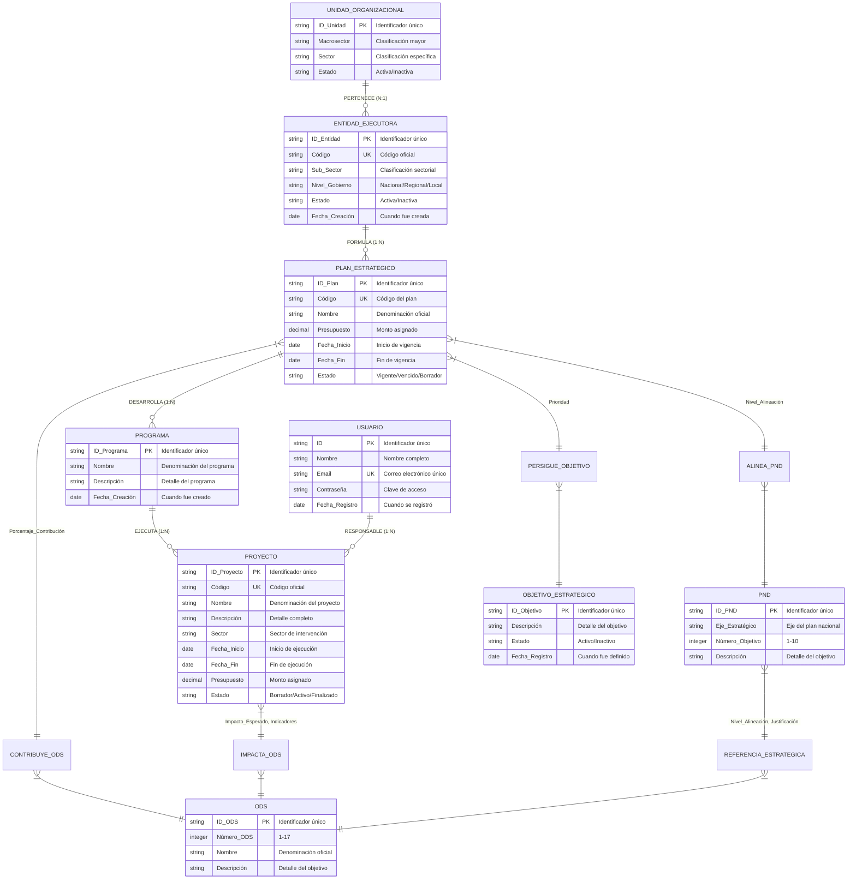
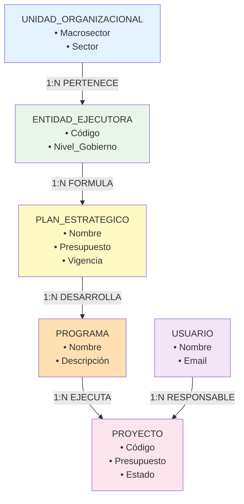
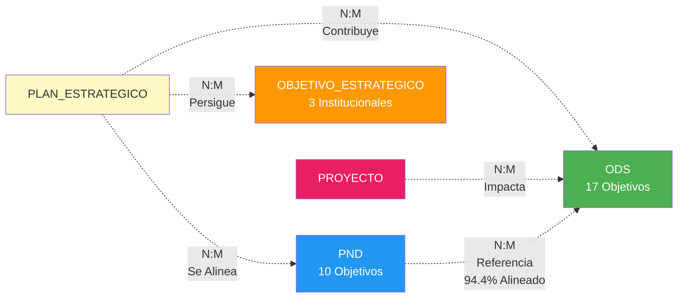

# 📊 **DIAGRAMA ENTIDAD-RELACIÓN (E-R) CONCEPTUAL**
## Sistema de Gestión de Planificación Institucional

---

## 🏗️ **MODELO CONCEPTUAL DE ENTIDADES**

### 👥 **ENTIDAD: Usuario**
```
┌─────────────────────────────┐
│          USUARIO            │
├─────────────────────────────┤
│ • ID                        │ [Identificador único]
│ • Nombre                    │ [Nombre completo]
│ • Email                     │ [Correo electrónico único]
│ • Contraseña               │ [Clave de acceso]
│ • Fecha Registro           │ [Cuando se registró]
└─────────────────────────────┘
```

### 🏢 **ENTIDAD: Unidad Organizacional**
```
┌─────────────────────────────┐
│      UNIDAD_ORGANIZACIONAL  │
├─────────────────────────────┤
│ • ID_Unidad                │ [Identificador único]
│ • Macrosector              │ [Clasificación mayor]
│ • Sector                   │ [Clasificación específica]
│ • Estado                   │ [Activa/Inactiva]
└─────────────────────────────┘
```

### 🏛️ **ENTIDAD: Entidad Ejecutora**
```
┌─────────────────────────────┐
│       ENTIDAD_EJECUTORA     │
├─────────────────────────────┤
│ • ID_Entidad               │ [Identificador único]
│ • Código                   │ [Código oficial]
│ • Sub_Sector               │ [Clasificación sectorial]
│ • Nivel_Gobierno           │ [Nacional/Regional/Local]
│ • Estado                   │ [Activa/Inactiva]
│ • Fecha_Creación           │ [Cuando fue creada]
└─────────────────────────────┘
```

### 📋 **ENTIDAD: Plan Estratégico**
```
┌─────────────────────────────┐
│       PLAN_ESTRATEGICO      │
├─────────────────────────────┤
│ • ID_Plan                  │ [Identificador único]
│ • Código                   │ [Código del plan]
│ • Nombre                   │ [Denominación oficial]
│ • Presupuesto              │ [Monto asignado]
│ • Fecha_Inicio             │ [Inicio de vigencia]
│ • Fecha_Fin                │ [Fin de vigencia]
│ • Estado                   │ [Vigente/Vencido/Borrador]
└─────────────────────────────┘
```

### 🎯 **ENTIDAD: Programa**
```
┌─────────────────────────────┐
│          PROGRAMA           │
├─────────────────────────────┤
│ • ID_Programa              │ [Identificador único]
│ • Nombre                   │ [Denominación del programa]
│ • Descripción              │ [Detalle del programa]
│ • Fecha_Creación           │ [Cuando fue creado]
└─────────────────────────────┘
```

### 🚀 **ENTIDAD: Proyecto**
```
┌─────────────────────────────┐
│          PROYECTO           │
├─────────────────────────────┤
│ • ID_Proyecto              │ [Identificador único]
│ • Código                   │ [Código oficial]
│ • Nombre                   │ [Denominación del proyecto]
│ • Descripción              │ [Detalle completo]
│ • Sector                   │ [Sector de intervención]
│ • Fecha_Inicio             │ [Inicio de ejecución]
│ • Fecha_Fin                │ [Fin de ejecución]
│ • Presupuesto              │ [Monto asignado]
│ • Estado                   │ [Borrador/Activo/Finalizado]
└─────────────────────────────┘
```

### 🌍 **ENTIDAD: ODS (Objetivo Desarrollo Sostenible)**
```
┌─────────────────────────────┐
│             ODS             │
├─────────────────────────────┤
│ • ID_ODS                   │ [Identificador único]
│ • Número_ODS               │ [1-17]
│ • Nombre                   │ [Denominación oficial]
│ • Descripción              │ [Detalle del objetivo]
└─────────────────────────────┘
```

### 🇵🇪 **ENTIDAD: PND (Plan Nacional Desarrollo)**
```
┌─────────────────────────────┐
│             PND             │
├─────────────────────────────┤
│ • ID_PND                   │ [Identificador único]
│ • Eje_Estratégico          │ [Eje del plan nacional]
│ • Número_Objetivo          │ [1-10]
│ • Descripción              │ [Detalle del objetivo]
└─────────────────────────────┘
```

### 🎯 **ENTIDAD: Objetivo Estratégico Institucional**
```
┌─────────────────────────────┐
│    OBJETIVO_ESTRATEGICO     │
├─────────────────────────────┤
│ • ID_Objetivo              │ [Identificador único]
│ • Descripción              │ [Detalle del objetivo]
│ • Estado                   │ [Activo/Inactivo]
│ • Fecha_Registro           │ [Cuando fue definido]
└─────────────────────────────┘
```

---

## 🔗 **RELACIONES CONCEPTUALES**

### 🏢 **JERARQUÍA ORGANIZACIONAL**

#### **R1: PERTENECE** (Entidad → Unidad)
- **Cardinalidad:** N:1 (Muchas entidades pertenecen a una unidad)
- **Descripción:** Cada entidad ejecutora pertenece a una unidad organizacional

#### **R2: FORMULA** (Entidad → Plan)
- **Cardinalidad:** 1:N (Una entidad formula muchos planes)
- **Descripción:** Cada entidad puede formular múltiples planes estratégicos

#### **R3: DESARROLLA** (Plan → Programa)
- **Cardinalidad:** 1:N (Un plan desarrolla muchos programas)
- **Descripción:** Cada plan se ejecuta a través de múltiples programas

#### **R4: EJECUTA** (Programa → Proyecto)
- **Cardinalidad:** 1:N (Un programa ejecuta muchos proyectos)
- **Descripción:** Cada programa se materializa en múltiples proyectos

#### **R5: RESPONSABLE** (Usuario → Proyecto)
- **Cardinalidad:** 1:N (Un usuario es responsable de muchos proyectos)
- **Descripción:** Cada usuario puede ser responsable de múltiples proyectos

### 🎯 **ALINEACIÓN ESTRATÉGICA**

#### **R6: CONTRIBUYE_ODS** (Plan ↔ ODS)
- **Cardinalidad:** N:M (Muchos planes contribuyen a muchos ODS)
- **Atributos:** Porcentaje_Contribución
- **Descripción:** Los planes contribuyen a objetivos de desarrollo sostenible

#### **R7: ALINEA_PND** (Plan ↔ PND)
- **Cardinalidad:** N:M (Muchos planes se alinean con muchos objetivos PND)
- **Atributos:** Nivel_Alineación
- **Descripción:** Los planes se alinean con objetivos del plan nacional

#### **R8: PERSIGUE_OBJETIVO** (Plan ↔ Objetivo_Estratégico)
- **Cardinalidad:** N:M (Muchos planes persiguen muchos objetivos estratégicos)
- **Atributos:** Prioridad
- **Descripción:** Los planes persiguen objetivos estratégicos institucionales

#### **R9: IMPACTA_ODS** (Proyecto ↔ ODS)
- **Cardinalidad:** N:M (Muchos proyectos impactan muchos ODS)
- **Atributos:** Impacto_Esperado, Indicadores
- **Descripción:** Los proyectos generan impacto directo en los ODS

#### **R10: REFERENCIA_ESTRATEGICA** (PND ↔ ODS)
- **Cardinalidad:** N:M (Muchos objetivos PND referencian muchos ODS)
- **Atributos:** Nivel_Alineación, Justificación
- **Descripción:** Alineación oficial entre plan nacional y agenda global

---

## 📊 **DIAGRAMA E-R CONCEPTUAL COMPLETO**



### 🔍 **VISTA SIMPLIFICADA DE JERARQUÍA ORGANIZACIONAL**



### 🎯 **VISTA DE ALINEACIÓN ESTRATÉGICA**



---

## 🎯 **REGLAS DE NEGOCIO IDENTIFICADAS**

1. **RN1:** Cada entidad ejecutora debe pertenecer a una unidad organizacional
2. **RN2:** Un plan estratégico debe ser formulado por al menos una entidad
3. **RN3:** Un programa debe estar asociado a un plan estratégico
4. **RN4:** Un proyecto debe ejecutarse dentro de un programa
5. **RN5:** Todo proyecto debe tener un usuario responsable
6. **RN6:** Los planes deben contribuir al menos a un ODS
7. **RN7:** La suma de contribuciones a ODS por plan no debe exceder 100%
8. **RN8:** Los planes deben alinearse con al menos un objetivo del PND
9. **RN9:** Los proyectos deben reportar impacto esperado en los ODS
10. **RN10:** Existe alineación oficial entre PND y ODS (94.4% según documento)

---

## 🔍 **ENTIDADES DÉBILES IDENTIFICADAS**

- **Programa:** Depende existencialmente de Plan_Estratégico
- **Proyecto:** Depende existencialmente de Programa

---

## 🌟 **ATRIBUTOS DERIVADOS**

- **Total_Proyectos_Plan:** Calculado desde programas y proyectos
- **Presupuesto_Total_Programa:** Suma de presupuestos de proyectos
- **Porcentaje_Avance:** Calculado según estado de proyectos
- **Impacto_Acumulado_ODS:** Suma de impactos de todos los proyectos

---

*Este diagrama E-R conceptual representa la lógica de negocio del sistema sin considerar aspectos técnicos de implementación, enfocándose en las entidades, atributos esenciales y relaciones que rigen el dominio de la planificación institucional.*