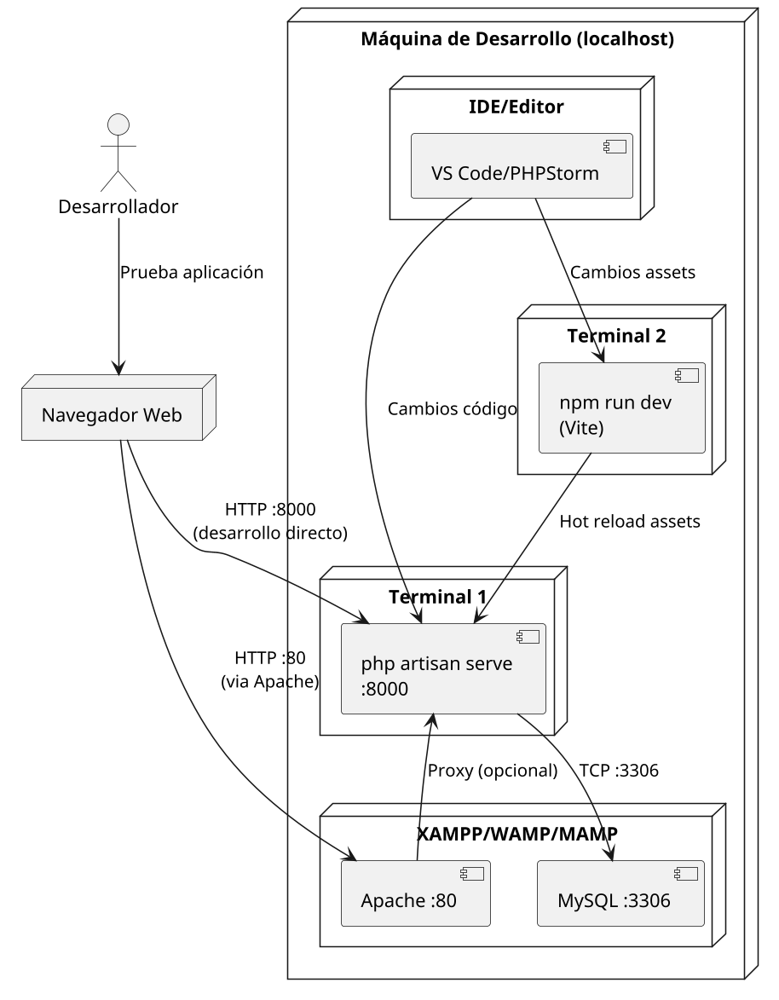
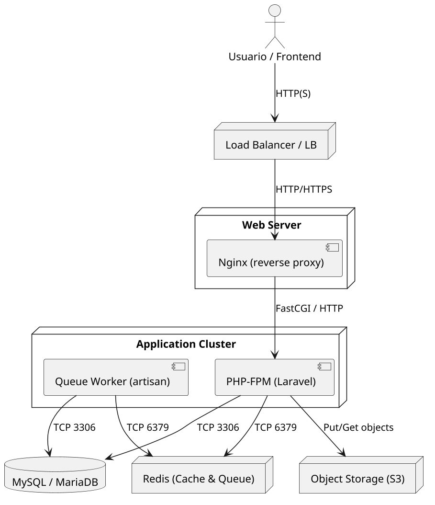

# Diagrama de Despliegue - Sistema SIPEIP 2.0

## 🎯 ¿Qué es un diagrama de despliegue?

Un **diagrama de despliegue** es como el "plano arquitectónico" de un sistema de software. Así como un arquitecto dibuja dónde van las habitaciones, tuberías y cables eléctricos en una casa, un diagrama de despliegue muestra:

### 📋 **Elementos clave:**
- **🖥️ Nodos**: Las "máquinas" donde corre el software (servidores, contenedores, tu laptop)
- **📦 Artefactos**: Las "aplicaciones" que se ejecutan (Laravel, MySQL, Nginx)
- **🔗 Conexiones**: Cómo se comunican entre sí (HTTP, TCP, puertos)
- **🌐 Protocolos**: El "idioma" que usan para hablar (HTTPS, SQL, Redis)

### 🎪 **¿Por qué es importante?**
1. **Planificación**: Saber qué recursos necesitas antes de instalar
2. **Troubleshooting**: Cuando algo falla, sabes dónde buscar
3. **Escalabilidad**: Entender qué componentes pueden crecer
4. **Seguridad**: Identificar puntos vulnerables y conexiones críticas
5. **Comunicación**: Explicar la arquitectura al equipo

---

## 📊 Análisis del Diagrama del Alumno (Cloud Deployment)

### 🔍 **Explicación paso a paso del diagrama cloud:**

```
[Usuario] --HTTPS--> [Google App Engine] --SQL--> [Cloud SQL/MySQL]
```

**1. 👤 Usuario (Device):**
- Representa cualquier persona usando la aplicación
- Desde su computadora, móvil o tablet
- Usa un navegador web (Chrome, Firefox, Safari)

**2. 🌐 Google App Engine (executionEnvironment):**
- Es como un "servidor virtual inteligente"
- Ejecuta el código PHP de Laravel automáticamente
- Se encarga de escalado (si hay más usuarios, crea más instancias)
- Maneja HTTPS y certificados SSL automáticamente

**3. 🗄️ Cloud SQL + MySQL (executionEnvironment):**
- Base de datos gestionada en la nube
- Google se encarga de backups, actualizaciones y seguridad
- Almacena todos los datos del SIPEIP (usuarios, planes, proyectos, etc.)

### ✅ **Fortalezas del diagrama:**
- **Arquitectura clara**: Separación lógica de responsabilidades
- **Tecnología apropiada**: App Engine es perfecto para Laravel
- **Seguridad**: HTTPS desde el inicio
- **Simplicidad**: Fácil de entender y mantener

### 🔧 **Componentes que mejorarían el diagrama:**

```
[Usuario] --HTTPS--> [Load Balancer] --HTTP--> [App Engine]
                                                    |
                                               [Cloud Storage] (archivos PDF, uploads)
                                                    |
                                               [Cloud Memorystore/Redis] (cache, sesiones)
                                                    |
                                               [Cloud SQL] (datos principales)
                                                    |
                                               [Cloud Tasks] (colas de trabajo)
```

**¿Por qué estos componentes?**
- **Load Balancer**: Distribuye tráfico, maneja SSL
- **Cloud Storage**: Para archivos grandes (reportes PDF, uploads)
- **Redis**: Cache para que la app sea más rápida
- **Cloud Tasks**: Para procesar reportes pesados sin bloquear la interfaz

---

## 🏠 Diagrama de Desarrollo Local (localhost) - EXPLICACIÓN DETALLADA

### 🎭 **El escenario local:**
Cuando desarrollas en tu computadora, tienes que "simular" lo que hace la nube:

```
Tu Computadora (localhost)
├── Terminal 1: php artisan serve :8000
├── Terminal 2: npm run dev (Vite)
├── XAMPP/WAMP: Apache :80 + MySQL :3306
└── Navegador: localhost:8000 o localhost:80
```

### 🔍 **Explicación paso a paso del entorno local:**

**1. 🖥️ Tu Computadora (localhost):**
- Es tu máquina de desarrollo
- Simula todos los servidores de producción
- Todo corre en diferentes puertos para no chocar

**2. 🚀 php artisan serve (Puerto 8000):**
- Es el "servidor web" de Laravel
- Comando: `php artisan serve`
- Solo para desarrollo, NO para producción
- Ventaja: Rápido de iniciar, fácil de reiniciar

**3. 🎨 npm run dev (Vite - Assets):**
- Compila CSS, JavaScript, imágenes
- Comando: `npm run dev`
- "Hot reload": Cambias CSS y se actualiza automáticamente
- Genera los archivos que usa el navegador

**4. 🗄️ MySQL (Puerto 3306):**
- Base de datos local (XAMPP, WAMP, Laragon)
- Mismos datos que tendrías en Cloud SQL
- Acceso directo desde phpMyAdmin

**5. 🌐 Apache (Puerto 80) - Opcional:**
- Servidor web "real" como en producción
- DocumentRoot apunta a `/public`
- Más parecido al entorno de producción

### 📊 **Flujo de desarrollo típico:**

```
[Tú] → [Código en VS Code] → [php artisan serve] → [MySQL]
  ↓                               ↓
[npm run dev] ←--hot reload--→ [Navegador]
```

**Paso a paso:**
1. **Escribes código** en VS Code/PHPStorm
2. **Guardas archivo** → artisan serve detecta cambio
3. **npm run dev** recompila CSS/JS automáticamente  
4. **Navegador** se actualiza (hot reload)
5. **Laravel** consulta MySQL para datos
6. **Resultado** se muestra en localhost:8000

---

## 🔄 Comparación Detallada: Cloud vs Local

| Componente | ☁️ **NUBE (Producción)** | 🏠 **LOCAL (Desarrollo)** |
|------------|-------------------------|---------------------------|
| **Web Server** | Google App Engine (automático) | `php artisan serve` (manual) |
| **Escalabilidad** | ∞ usuarios simultáneos | 1 desarrollador |
| **Base de Datos** | Cloud SQL (gestionada) | MySQL local (XAMPP) |
| **Backups** | Automáticos cada día | Los haces tú (¡o se pierden!) |
| **SSL/HTTPS** | Certificado automático | HTTP simple (localhost) |
| **Performance** | Optimizada, CDN global | Depende de tu laptop |
| **Costos** | $$ por uso/tráfico | Gratis (solo tu electricidad) |
| **Assets** | Build optimizado + CDN | Hot reload para desarrollo |
| **Mantenimiento** | Google lo maneja | Tú instalas, actualizas, arreglas |

### 🚦 **¿Cuándo usar cada uno?**

**🏠 Desarrollo Local - Úsalo cuando:**
- Estés programando nuevas funciones
- Probando cambios antes de subir
- Aprendiendo Laravel/PHP
- No tengas internet estable
- Quieras desarrollar rápido y gratis

**☁️ Cloud/Producción - Úsalo cuando:**
- Los usuarios reales accedan al sistema
- Necesites que esté disponible 24/7
- Tengas múltiples desarrolladores
- Requieras backups automáticos
- El sistema sea crítico para la organización

---

## 🛠️ Configuración Paso a Paso

### 🏠 **Entorno Local - 3 Opciones:**

#### **Opción A: Solo Laravel (Más Simple)**
```bash
# Terminal 1: Servidor web
php artisan serve --host=0.0.0.0 --port=8000

# Terminal 2: Assets (CSS/JS)
npm run dev

# Acceso: http://localhost:8000
```

**✅ Ventajas:** Rápido, simple, perfecto para empezar
**❌ Desventajas:** No es exactamente como producción

#### **Opción B: Apache + Laravel (Más Realista)**
```bash
# 1. Configurar Virtual Host en Apache (httpd.conf)
# 2. DocumentRoot → /tu-proyecto/public
# 3. Restart Apache

# Terminal: Assets
npm run dev

# Acceso: http://localhost (puerto 80)
```

**✅ Ventajas:** Más parecido a producción, URLs limpias
**❌ Desventajas:** Más configuración inicial

#### **Opción C: Docker (Más Profesional)**
```bash
# Usar archivo docker-compose.override.yml
docker compose up -d

# Ejecutar migraciones
docker exec -it sipeip_app php artisan migrate --seed

# Acceso: http://localhost:8000
```

**✅ Ventajas:** Entorno idéntico para todo el equipo
**❌ Desventajas:** Requiere aprender Docker

### ☁️ **Entorno Cloud - Google App Engine:**

#### **Paso 1: Preparar el proyecto**
```bash
# Archivo: app.yaml
runtime: php81
env_variables:
  APP_ENV: production
  APP_KEY: tu-app-key-aqui
```

#### **Paso 2: Deploy**
```bash
# Instalar Google Cloud SDK
gcloud app deploy

# Tu app estará en: https://tu-proyecto.appspot.com
```

---

## 🎯 Preguntas Frecuentes

**❓ ¿Por qué usar dos entornos diferentes?**
- Local: Para desarrollar rápido y sin costos
- Cloud: Para que los usuarios reales usen el sistema

**❓ ¿Puedo usar solo local?**
- Sí, pero solo tú podrás acceder al sistema
- Los demás no podrán usarlo desde internet

**❓ ¿Es caro el entorno cloud?**
- App Engine: ~$0.05 por cada 1000 requests
- Cloud SQL: ~$25/mes por instancia pequeña
- Para proyectos estudiantiles: Google da $300 gratis

**❓ ¿Qué pasa si mi laptop se rompe?**
- Local: Pierdes todo (¡haz backups!)
- Cloud: Todo está respaldado automáticamente

**❓ ¿Puedo cambiar de local a cloud después?**
- ¡Sí! Laravel está diseñado para esto
- Solo cambias archivos de configuración

---

## 🎓 Resumen para Estudiantes

### **🎯 Lo que debes entender:**

1. **Diagrama = Mapa**: Te dice dónde está cada cosa
2. **Local ≠ Producción**: Son diferentes, pero deben hacer lo mismo
3. **Componentes**: Cada caja tiene una función específica
4. **Conexiones**: Las flechas muestran cómo se comunican
5. **Escalabilidad**: Cloud crece automáticamente, local no

### **📝 Para tu examen/proyecto:**
- Puedes explicar la diferencia entre development y production
- Entiendes por qué usamos diferentes herramientas en cada entorno
- Sabes identificar los componentes críticos (web, app, db)
- Puedes justificar por qué elegiste ciertas tecnologías

---

*Documento actualizado y mejorado - Octubre 2025*

### PlantUML - Entorno Local:



### Diagrama ASCII - Desarrollo Local:

```
[Desarrollador]
      |
      v
 [Navegador] (:80 o :8000)
      |
    ┌─────────────────┐
    │                 │
    v                 v
[Apache :80]    [php artisan serve :8000]
    │                 │
    │                 v
    │            [MySQL :3306]
    │                 ↑
    v                 │
[DocumentRoot]        │
    ↑                 │
    │                 │
[npm run dev] ────────┘
    ↑
    │
[VS Code/IDE]
```

---

## 🔄 Comparación: Cloud vs Local

| Aspecto | Cloud (Producción) | Local (Desarrollo) |
|---------|-------------------|-------------------|
| **Web Server** | Google App Engine | Apache + php artisan serve |
| **Base de Datos** | Cloud SQL (MySQL) | MySQL local (XAMPP) |
| **Cache** | Cloud Memorystore | Sin cache (o Redis local) |
| **Assets** | Build process + CDN | npm run dev (hot reload) |
| **Storage** | Cloud Storage | Filesystem local |
| **Queues** | Cloud Tasks | Sin queues (o local Redis) |
| **SSL** | Automático (App Engine) | HTTP local (:8000, :80) |
| **Escalabilidad** | Automática | Una instancia |
| **Performance** | Optimizada | Para desarrollo |

---

## 🛠️ Configuración paso a paso - Desarrollo Local

### Opción A: Solo Laravel (Recomendado para desarrollo rápido)
```bash
# Terminal 1: Servidor Laravel
php artisan serve --host=0.0.0.0 --port=8000

# Terminal 2: Build de assets
npm run dev
# o para auto-reload:
npm run watch
```

**URLs de acceso:**
- **Aplicación**: http://localhost:8000
- **Hot reload**: Automático con Vite/Laravel Mix

### Opción B: Apache + Laravel (Más cercano a producción)
```bash
# 1. Configurar Virtual Host en Apache
# 2. DocumentRoot apunta a /public
# 3. Terminal: Assets
npm run dev

# 4. Terminal: Queue worker (opcional)
php artisan queue:work
```

**URLs de acceso:**
- **Aplicación**: http://localhost (puerto 80)
- **phpMyAdmin**: http://localhost/phpmyadmin

### Opción C: Docker Compose para desarrollo
```bash
# Usar docker-compose.override.yml (desarrollo)
docker compose up -d
docker exec -it sipeip_app php artisan migrate --seed
```

---

## 📋 Requisitos por Entorno

### Desarrollo Local:
- **PHP** 8.1+ con extensiones: mbstring, xml, pdo_mysql, zip, gd
- **Composer** para dependencias PHP
- **Node.js** 16+ y npm para assets
- **MySQL** 8.0+ o MariaDB 10.3+
- **Apache/Nginx** (opcional, alternativa a artisan serve)

### Cloud/Producción:
- **Google Cloud Platform** account
- **App Engine** standard environment
- **Cloud SQL** instance (MySQL 8.0)
- **Cloud Storage** bucket para archivos
- **Cloud Build** para CI/CD (opcional)

---
Este sistema Laravel puede desplegarse en Docker Compose para entornos pequeños/medianos o Kubernetes para entornos productivos escalables. La propuesta mínima incluye:

- Balanceador / Load Balancer (opcional en pequeño despliegue)
- Nginx (frontend web)
- PHP-FPM (contenedor que ejecuta Laravel)
- Base de datos (MySQL/MariaDB)
- Cache / Session (Redis)
- Queue worker (Laravel queue:work)
- Almacenamiento persistente (volúmenes para "public" y backups)
- (Opcional) Object Storage (S3-compatible) para archivos

---

## PlantUML (diagrama de despliegue)
Puedes pegar el siguiente bloque en cualquier editor PlantUML para generar el diagrama visual.



---

## Diagrama ASCII simplificado

```
[Usuario] -> [Load Balancer]
                   |
                   v
               [Nginx]
                   |
          -------------------
          |                 |
          v                 v
     [PHP-FPM]         [Queue Worker]
          |                 |
          v                 v
       [Redis]           [MySQL]
          |
          v
    [Object Storage]
```

---

## Ejemplo de configuración: Docker Compose (producción ligera)
Archivo ejemplo: `docker-compose.prod.yml`. Este ejemplo está pensado para adaptarse y no pretende cubrir hardening/compliance.

- Servicio `app`: contenedor PHP-FPM que monta el código
- Servicio `web`: Nginx que expone el puerto 80/443
- Servicio `db`: MySQL con persistencia
- Servicio `redis`: Redis para cache/sessions/queues
- Servicio `worker`: ejecutor de colas Laravel

> ADVERTENCIA: Ajusta variables (contraseñas/volúmenes) antes de usar en producción.

```yaml
version: '3.8'
services:
  app:
    image: php:8.1-fpm
    container_name: sipeip_app
    restart: unless-stopped
    working_dir: /var/www/html
    volumes:
      - ./:/var/www/html:delegated
    environment:
      - APP_ENV=production
      - APP_DEBUG=false
      - APP_KEY=
      - DB_HOST=db
      - REDIS_HOST=redis
    depends_on:
      - db
      - redis

  web:
    image: nginx:stable-alpine
    container_name: sipeip_web
    restart: unless-stopped
    ports:
      - 80:80
      # - 443:443  # habilitar si configura SSL
    volumes:
      - ./public:/var/www/html/public:ro
      - ./docker/nginx/default.conf:/etc/nginx/conf.d/default.conf:ro
    depends_on:
      - app

  db:
    image: mysql:8.0
    container_name: sipeip_db
    restart: unless-stopped
    environment:
      MYSQL_DATABASE: sipeip
      MYSQL_ROOT_PASSWORD: rootpassword
      MYSQL_USER: sipeip_user
      MYSQL_PASSWORD: sipeippw
    volumes:
      - db_data:/var/lib/mysql
    healthcheck:
      test: ["CMD-SHELL", "mysqladmin ping -h localhost -p$${MYSQL_ROOT_PASSWORD}" ]
      interval: 10s
      timeout: 5s
      retries: 5

  redis:
    image: redis:6-alpine
    container_name: sipeip_redis
    restart: unless-stopped
    volumes:
      - redis_data:/data

  worker:
    image: php:8.1-cli
    container_name: sipeip_worker
    restart: unless-stopped
    working_dir: /var/www/html
    volumes:
      - ./:/var/www/html:delegated
    depends_on:
      - app
      - redis
      - db
    command: sh -c "php artisan queue:work --sleep=3 --tries=3 --timeout=60"

volumes:
  db_data:
  redis_data:
```

---

## Nginx - snippet (ejemplo `default.conf`)

```nginx
server {
    listen 80;
    server_name _;
    root /var/www/html/public;

    index index.php index.html;

    location / {
        try_files $uri $uri/ /index.php?$query_string;
    }

    location ~ \.php$ {
        fastcgi_pass app:9000;
        fastcgi_index index.php;
        include fastcgi_params;
        fastcgi_param SCRIPT_FILENAME $document_root$fastcgi_script_name;
        fastcgi_param PATH_INFO $fastcgi_path_info;
    }

    location ~ /\.ht {
        deny all;
    }
}
```

---

## Consideraciones para producción
- Usar `Dockerfile` personalizado para instalar extensiones PHP necesarias (pdo_mysql, exif, gd, redis, mbstring, zip, bcmath, etc.)
- Separar redes y aplicar políticas de firewall y seguridad
- Usar variables de entorno seguras y un sistema de secretos
- Hacer backups periódicos de la BD y volúmenes
- Considerar Kubernetes para alta disponibilidad y escalado
- Implementar CI/CD (GitHub Actions, GitLab CI) para despliegues automatizados

---

## Próximos pasos
1. ¿Deseas que genere un `Dockerfile` base adaptado a Laravel (extensiones, composer)?
2. ¿Prefieres que adapte este `docker-compose.prod.yml` para Windows (paths) o para un servidor Linux (recomendado)?
3. ¿Quieres que exporte el PlantUML como PNG/SVG aquí (necesita herramienta externa)?

*Archivo generado automáticamente el 16-Oct-2025*